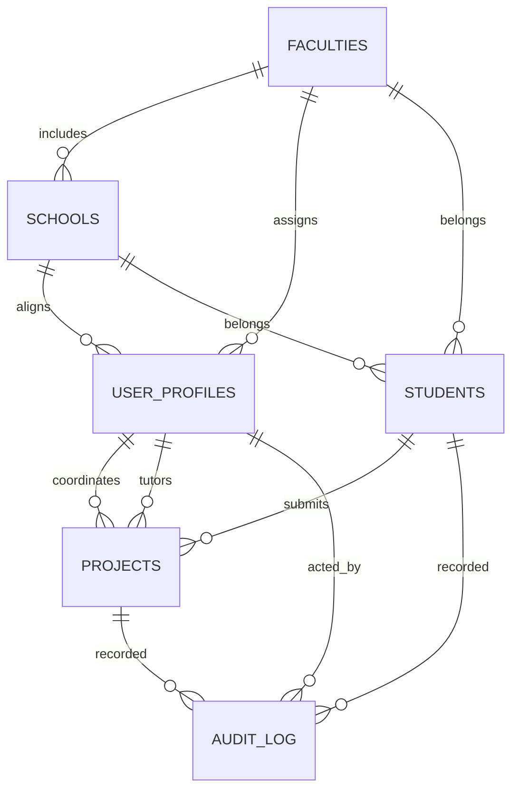

# Data Dictionary and Access Model

## Tables

### faculties
| Column | Type | Description |
| --- | --- | --- |
| id | uuid (PK) | Faculty identifier. |
| name | text (unique) | Faculty name. |
| created_at | timestamptz | Creation timestamp (UTC). |
| updated_at | timestamptz | Last update timestamp (UTC). |

### schools
| Column | Type | Description |
| --- | --- | --- |
| id | uuid (PK) | School identifier. |
| faculty_id | uuid (FK → faculties.id) | Owning faculty. |
| name | text | School name, unique per faculty. |
| created_at | timestamptz | Creation timestamp (UTC). |
| updated_at | timestamptz | Last update timestamp (UTC). |

### user_profiles
| Column | Type | Description |
| --- | --- | --- |
| user_id | uuid (PK, FK → auth.users.id) | Supabase auth user. |
| full_name | text | Display name. |
| role | app_role enum | One of rectoria, vicerrectorado, planeamiento, decano, director_escuela, coordinador, tutor, student. |
| faculty_id | uuid (FK → faculties.id, nullable) | Affiliated faculty. |
| school_id | uuid (FK → schools.id, nullable) | Affiliated school. |
| created_at | timestamptz | Creation timestamp (UTC). |
| updated_at | timestamptz | Last update timestamp (UTC). |

### students
| Column | Type | Description |
| --- | --- | --- |
| id | uuid (PK) | Student profile identifier. |
| user_id | uuid (FK → auth.users.id, unique) | Auth user owning the student profile. |
| first_name | text | Nombres. |
| last_name | text | Apellidos. |
| ci | text (unique) | Cédula de identidad. |
| email | text (unique) | Dirección de correo electrónico. |
| contacts | text[] | Up to two contact numbers. |
| faculty_id | uuid (FK → faculties.id) | Faculty membership. |
| school_id | uuid (FK → schools.id) | School membership (must align with faculty_id). |
| semester | smallint | Semester number (1-12). |
| shift | text | Turno. |
| section | text | Sección. |
| created_at | timestamptz | Creation timestamp (UTC). |
| updated_at | timestamptz | Last update timestamp (UTC). |

### projects
| Column | Type | Description |
| --- | --- | --- |
| id | uuid (PK) | Project identifier. |
| student_id | uuid (FK → students.id) | Owning student. |
| coordinator_id | uuid (FK → user_profiles.user_id) | Coordinator (role coordinador). |
| tutor_id | uuid (FK → user_profiles.user_id) | Tutor (role tutor). |
| name | text | Project name. |
| general_objective | text | Objetivo general. |
| specific_objectives | text[] | Up to four objetivos específicos. |
| justification | text | Justificación. |
| introduction | text | Introducción. |
| summary | text | Resumen. |
| institution | text | Institución donde se cumple el servicio. |
| start_date | date | Fecha de inicio. |
| end_date | date | Fecha aproximada de cierre. |
| preproject_approved | boolean | Anteproyecto aprobado sí/no. |
| preproject_approved_at | date | Fecha de aprobación de anteproyecto. |
| project_received | boolean | Proyecto recibido sí/no. |
| project_received_at | date | Fecha de recepción. |
| final_approved | boolean | Aprobado proyecto final sí/no. |
| final_approved_at | date | Fecha de aprobación final. |
| created_at | timestamptz | Creation timestamp (UTC). |
| updated_at | timestamptz | Last update timestamp (UTC). |

### audit_log
| Column | Type | Description |
| --- | --- | --- |
| id | bigserial (PK) | Audit entry identifier. |
| table_name | text | Table being logged. |
| record_id | text | Primary key value of the affected row. |
| action | text | INSERT, UPDATE, or DELETE. |
| old_data | jsonb | Snapshot before change (null on insert). |
| new_data | jsonb | Snapshot after change. |
| performed_by | uuid | auth.uid() that triggered the change. |
| created_at | timestamptz | Logged at (UTC). |

## Roles and RLS
- `app_role` enum backs JWT claims and `user_profiles.role`.
- Helper functions: `current_app_role`, `get_claim_text`, `staff_roles`, and `has_role` check JWT claims first, then fall back to the stored profile.
- RLS is enabled on every table. Staff roles (rectoria, vicerrectorado, planeamiento, decano, director_escuela, coordinador) can read and manage reference data; students can see their own rows and may see catalog tables. Coordinators/tutors are stored in `user_profiles` and referenced by projects.
- Delete operations are blocked via RLS deny-all delete policies plus `prevent_delete` triggers on core tables and the audit log.

## Audit Logging Strategy
- `handle_audit` SECURITY DEFINER trigger logs INSERT and UPDATE changes for faculties, schools, user_profiles, students, and projects into `audit_log`, capturing before/after images and `auth.uid()`.
- `set_updated_at` trigger maintains `updated_at` automatically.
- `prevent_delete` trigger raises an exception on delete attempts to enforce immutability of audit and core records.

## Mermaid ERD

