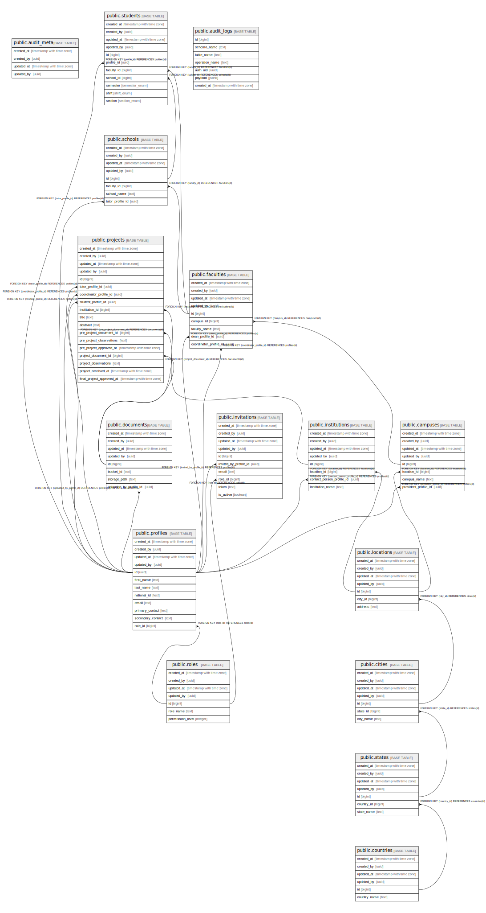

# postgres

## Tables

| Name | Columns | Comment | Type |
| ---- | ------- | ------- | ---- |
| [public.audit_meta](public.audit_meta.md) | 4 |  | BASE TABLE |
| [public.countries](public.countries.md) | 6 |  | BASE TABLE |
| [public.states](public.states.md) | 7 |  | BASE TABLE |
| [public.cities](public.cities.md) | 7 |  | BASE TABLE |
| [public.locations](public.locations.md) | 7 |  | BASE TABLE |
| [public.roles](public.roles.md) | 7 |  | BASE TABLE |
| [public.profiles](public.profiles.md) | 12 |  | BASE TABLE |
| [public.campuses](public.campuses.md) | 8 |  | BASE TABLE |
| [public.faculties](public.faculties.md) | 9 |  | BASE TABLE |
| [public.schools](public.schools.md) | 8 |  | BASE TABLE |
| [public.students](public.students.md) | 11 |  | BASE TABLE |
| [public.institutions](public.institutions.md) | 8 |  | BASE TABLE |
| [public.documents](public.documents.md) | 8 |  | BASE TABLE |
| [public.projects](public.projects.md) | 18 |  | BASE TABLE |
| [public.invitations](public.invitations.md) | 10 |  | BASE TABLE |
| [public.audit_logs](public.audit_logs.md) | 7 |  | BASE TABLE |

## Stored procedures and functions

| Name | ReturnType | Arguments | Type |
| ---- | ------- | ------- | ---- |
| public.plpgsql_check_function_tb | record | funcoid regprocedure, relid regclass DEFAULT 0, fatal_errors boolean DEFAULT true, other_warnings boolean DEFAULT true, performance_warnings boolean DEFAULT false, extra_warnings boolean DEFAULT true, security_warnings boolean DEFAULT false, compatibility_warnings boolean DEFAULT false, oldtable name DEFAULT NULL::name, newtable name DEFAULT NULL::name, anyelememttype regtype DEFAULT 'integer'::regtype, anyenumtype regtype DEFAULT '-'::regtype, anyrangetype regtype DEFAULT 'int4range'::regtype, anycompatibletype regtype DEFAULT 'integer'::regtype, anycompatiblerangetype regtype DEFAULT 'int4range'::regtype, without_warnings boolean DEFAULT false, all_warnings boolean DEFAULT false, use_incomment_options boolean DEFAULT true, incomment_options_usage_warning boolean DEFAULT false, constant_tracing boolean DEFAULT true | FUNCTION |
| public.plpgsql_check_function | text | funcoid regprocedure, relid regclass DEFAULT 0, format text DEFAULT 'text'::text, fatal_errors boolean DEFAULT true, other_warnings boolean DEFAULT true, performance_warnings boolean DEFAULT false, extra_warnings boolean DEFAULT true, security_warnings boolean DEFAULT false, compatibility_warnings boolean DEFAULT false, oldtable name DEFAULT NULL::name, newtable name DEFAULT NULL::name, anyelememttype regtype DEFAULT 'integer'::regtype, anyenumtype regtype DEFAULT '-'::regtype, anyrangetype regtype DEFAULT 'int4range'::regtype, anycompatibletype regtype DEFAULT 'integer'::regtype, anycompatiblerangetype regtype DEFAULT 'int4range'::regtype, without_warnings boolean DEFAULT false, all_warnings boolean DEFAULT false, use_incomment_options boolean DEFAULT true, incomment_options_usage_warning boolean DEFAULT false, constant_tracing boolean DEFAULT true | FUNCTION |
| public.plpgsql_check_function_tb | record | name text, relid regclass DEFAULT 0, fatal_errors boolean DEFAULT true, other_warnings boolean DEFAULT true, performance_warnings boolean DEFAULT false, extra_warnings boolean DEFAULT true, security_warnings boolean DEFAULT false, compatibility_warnings boolean DEFAULT false, oldtable name DEFAULT NULL::name, newtable name DEFAULT NULL::name, anyelememttype regtype DEFAULT 'integer'::regtype, anyenumtype regtype DEFAULT '-'::regtype, anyrangetype regtype DEFAULT 'int4range'::regtype, anycompatibletype regtype DEFAULT 'integer'::regtype, anycompatiblerangetype regtype DEFAULT 'int4range'::regtype, without_warnings boolean DEFAULT false, all_warnings boolean DEFAULT false, use_incomment_options boolean DEFAULT true, incomment_options_usage_warning boolean DEFAULT false, constant_tracing boolean DEFAULT true | FUNCTION |
| public.plpgsql_check_function | text | name text, relid regclass DEFAULT 0, format text DEFAULT 'text'::text, fatal_errors boolean DEFAULT true, other_warnings boolean DEFAULT true, performance_warnings boolean DEFAULT false, extra_warnings boolean DEFAULT true, security_warnings boolean DEFAULT false, compatibility_warnings boolean DEFAULT false, oldtable name DEFAULT NULL::name, newtable name DEFAULT NULL::name, anyelememttype regtype DEFAULT 'integer'::regtype, anyenumtype regtype DEFAULT '-'::regtype, anyrangetype regtype DEFAULT 'int4range'::regtype, anycompatibletype regtype DEFAULT 'integer'::regtype, anycompatiblerangetype regtype DEFAULT 'int4range'::regtype, without_warnings boolean DEFAULT false, all_warnings boolean DEFAULT false, use_incomment_options boolean DEFAULT true, incomment_options_usage_warning boolean DEFAULT false, constant_tracing boolean DEFAULT true | FUNCTION |
| public.__plpgsql_show_dependency_tb | record | funcoid regprocedure, relid regclass DEFAULT 0, anyelememttype regtype DEFAULT 'integer'::regtype, anyenumtype regtype DEFAULT '-'::regtype, anyrangetype regtype DEFAULT 'int4range'::regtype, anycompatibletype regtype DEFAULT 'integer'::regtype, anycompatiblerangetype regtype DEFAULT 'int4range'::regtype | FUNCTION |
| public.__plpgsql_show_dependency_tb | record | name text, relid regclass DEFAULT 0, anyelememttype regtype DEFAULT 'integer'::regtype, anyenumtype regtype DEFAULT '-'::regtype, anyrangetype regtype DEFAULT 'int4range'::regtype, anycompatibletype regtype DEFAULT 'integer'::regtype, anycompatiblerangetype regtype DEFAULT 'int4range'::regtype | FUNCTION |
| public.plpgsql_show_dependency_tb | record | funcoid regprocedure, relid regclass DEFAULT 0, anyelememttype regtype DEFAULT 'integer'::regtype, anyenumtype regtype DEFAULT '-'::regtype, anyrangetype regtype DEFAULT 'int4range'::regtype, anycompatibletype regtype DEFAULT 'integer'::regtype, anycompatiblerangetype regtype DEFAULT 'int4range'::regtype | FUNCTION |
| public.plpgsql_show_dependency_tb | record | fnname text, relid regclass DEFAULT 0, anyelememttype regtype DEFAULT 'integer'::regtype, anyenumtype regtype DEFAULT '-'::regtype, anyrangetype regtype DEFAULT 'int4range'::regtype, anycompatibletype regtype DEFAULT 'integer'::regtype, anycompatiblerangetype regtype DEFAULT 'int4range'::regtype | FUNCTION |
| public.plpgsql_profiler_function_tb | record | funcoid regprocedure | FUNCTION |
| public.plpgsql_profiler_function_tb | record | name text | FUNCTION |
| public.plpgsql_profiler_function_statements_tb | record | funcoid regprocedure | FUNCTION |
| public.plpgsql_profiler_function_statements_tb | record | name text | FUNCTION |
| public.plpgsql_profiler_install_fake_queryid_hook | void |  | FUNCTION |
| public.plpgsql_profiler_remove_fake_queryid_hook | void |  | FUNCTION |
| public.plpgsql_profiler_reset_all | void |  | FUNCTION |
| public.plpgsql_profiler_reset | void | funcoid regprocedure | FUNCTION |
| public.plpgsql_coverage_statements | float8 | funcoid regprocedure | FUNCTION |
| public.plpgsql_coverage_statements | float8 | name text | FUNCTION |
| public.plpgsql_coverage_branches | float8 | funcoid regprocedure | FUNCTION |
| public.plpgsql_coverage_branches | float8 | name text | FUNCTION |
| public.plpgsql_check_pragma | int4 | VARIADIC name text[] | FUNCTION |
| public.plpgsql_profiler_functions_all | record |  | FUNCTION |
| public.plpgsql_check_profiler | bool | enable boolean DEFAULT NULL::boolean | FUNCTION |
| public.plpgsql_check_tracer | bool | enable boolean DEFAULT NULL::boolean, verbosity text DEFAULT NULL::text | FUNCTION |
| public.handle_audit_update | trigger |  | FUNCTION |
| public.enable_audit_tracking | void | VARIADIC target_table_names text[] | PROCEDURE |
| public.log_changes | trigger |  | FUNCTION |
| public.attach_audit_triggers | void | VARIADIC table_names text[] | PROCEDURE |
| public.setup_audit | void | VARIADIC table_names text[] | PROCEDURE |

## Enums

| Name | Values |
| ---- | ------- |
| auth.aal_level | aal1, aal2, aal3 |
| auth.code_challenge_method | plain, s256 |
| auth.factor_status | unverified, verified |
| auth.factor_type | phone, totp, webauthn |
| auth.oauth_authorization_status | approved, denied, expired, pending |
| auth.oauth_client_type | confidential, public |
| auth.oauth_registration_type | dynamic, manual |
| auth.oauth_response_type | code |
| auth.one_time_token_type | confirmation_token, email_change_token_current, email_change_token_new, phone_change_token, reauthentication_token, recovery_token |
| net.request_status | ERROR, PENDING, SUCCESS |
| public.section_enum | A, B, C, D, E, F |
| public.semester_enum | 1, 10, 2, 3, 4, 5, 6, 7, 8, 9 |
| public.shift_enum | EVENING, MORNING |
| realtime.action | DELETE, ERROR, INSERT, TRUNCATE, UPDATE |
| realtime.equality_op | eq, gt, gte, in, lt, lte, neq |
| storage.buckettype | ANALYTICS, STANDARD, VECTOR |

## Relations

---

> Generated by [tbls](https://github.com/k1LoW/tbls)
