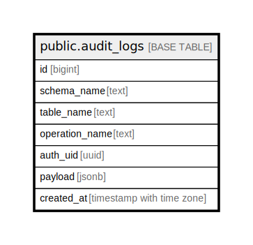

# public.audit_logs

## Description

## Columns

| Name | Type | Default | Nullable | Children | Parents | Comment |
| ---- | ---- | ------- | -------- | -------- | ------- | ------- |
| id | bigint |  | false |  |  |  |
| schema_name | text |  | false |  |  |  |
| table_name | text |  | false |  |  |  |
| operation_name | text |  | false |  |  |  |
| auth_uid | uuid | auth.uid() | true |  |  |  |
| payload | jsonb |  | true |  |  |  |
| created_at | timestamp with time zone | now() | true |  |  |  |

## Constraints

| Name | Type | Definition |
| ---- | ---- | ---------- |
| audit_logs_pkey | PRIMARY KEY | PRIMARY KEY (id) |

## Indexes

| Name | Definition |
| ---- | ---------- |
| audit_logs_pkey | CREATE UNIQUE INDEX audit_logs_pkey ON public.audit_logs USING btree (id) |
| idx_audit_logs_table | CREATE INDEX idx_audit_logs_table ON public.audit_logs USING btree (table_name) |
| idx_audit_logs_created | CREATE INDEX idx_audit_logs_created ON public.audit_logs USING btree (created_at) |

## Relations

---

> Generated by [tbls](https://github.com/k1LoW/tbls)
