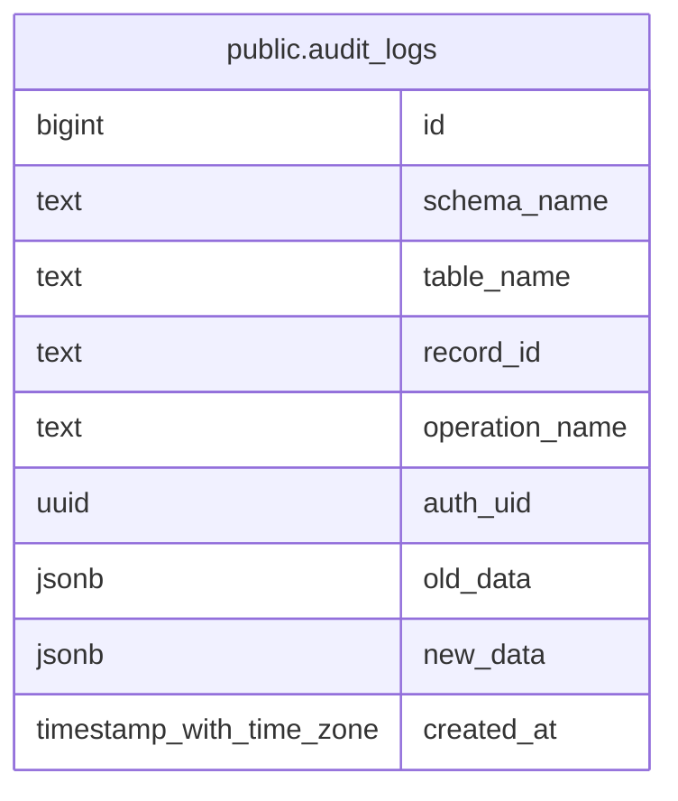

# public.audit_logs

## Description

## Columns

| Name | Type | Default | Nullable | Children | Parents | Comment |
| ---- | ---- | ------- | -------- | -------- | ------- | ------- |
| id | bigint |  | false |  |  |  |
| schema_name | text |  | false |  |  |  |
| table_name | text |  | false |  |  |  |
| record_id | text |  | true |  |  |  |
| operation_name | text |  | false |  |  |  |
| auth_uid | uuid | auth.uid() | true |  |  |  |
| old_data | jsonb |  | true |  |  |  |
| new_data | jsonb |  | true |  |  |  |
| created_at | timestamp with time zone | now() | true |  |  |  |

## Constraints

| Name | Type | Definition |
| ---- | ---- | ---------- |
| audit_logs_pkey | PRIMARY KEY | PRIMARY KEY (id) |

## Indexes

| Name | Definition |
| ---- | ---------- |
| audit_logs_pkey | CREATE UNIQUE INDEX audit_logs_pkey ON public.audit_logs USING btree (id) |
| idx_audit_logs_table | CREATE INDEX idx_audit_logs_table ON public.audit_logs USING btree (table_name) |
| idx_audit_logs_table_record | CREATE INDEX idx_audit_logs_table_record ON public.audit_logs USING btree (table_name, record_id, created_at DESC) |
| idx_audit_logs_created | CREATE INDEX idx_audit_logs_created ON public.audit_logs USING btree (created_at) |

## Relations

```mermaid
erDiagram


"public.audit_logs" {
  bigint id ""
  text schema_name ""
  text table_name ""
  text record_id ""
  text operation_name ""
  uuid auth_uid ""
  jsonb old_data ""
  jsonb new_data ""
  timestamp_with_time_zone created_at ""
}
```

---

> Generated by [tbls](https://github.com/k1LoW/tbls)
