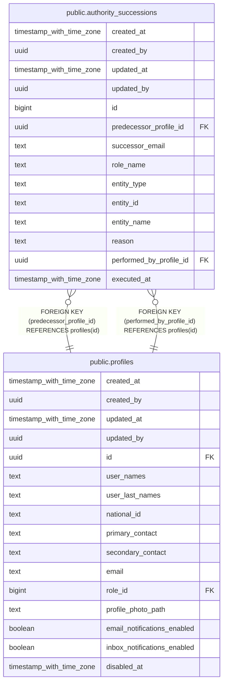

# public.authority_successions

## Description

## Columns

| Name | Type | Default | Nullable | Children | Parents | Comment |
| ---- | ---- | ------- | -------- | -------- | ------- | ------- |
| created_at | timestamp with time zone | now() | false |  |  |  |
| created_by | uuid | auth.uid() | false |  |  |  |
| updated_at | timestamp with time zone | now() | false |  |  |  |
| updated_by | uuid | auth.uid() | true |  |  |  |
| id | bigint |  | false |  |  |  |
| predecessor_profile_id | uuid |  | false |  | [public.profiles](public.profiles.md) |  |
| successor_email | text |  | false |  |  |  |
| role_name | text |  | false |  |  |  |
| entity_type | text |  | false |  |  |  |
| entity_id | text |  | false |  |  |  |
| entity_name | text |  | false |  |  |  |
| reason | text |  | true |  |  |  |
| performed_by_profile_id | uuid |  | false |  | [public.profiles](public.profiles.md) |  |
| executed_at | timestamp with time zone | now() | false |  |  |  |

## Constraints

| Name | Type | Definition |
| ---- | ---- | ---------- |
| authority_successions_performed_by_profile_id_fkey | FOREIGN KEY | FOREIGN KEY (performed_by_profile_id) REFERENCES profiles(id) |
| authority_successions_predecessor_profile_id_fkey | FOREIGN KEY | FOREIGN KEY (predecessor_profile_id) REFERENCES profiles(id) |
| authority_successions_pkey | PRIMARY KEY | PRIMARY KEY (id) |

## Indexes

| Name | Definition |
| ---- | ---------- |
| authority_successions_pkey | CREATE UNIQUE INDEX authority_successions_pkey ON public.authority_successions USING btree (id) |

## Triggers

| Name | Definition |
| ---- | ---------- |
| audit_authority_successions_changes | CREATE TRIGGER audit_authority_successions_changes AFTER INSERT OR DELETE OR UPDATE ON public.authority_successions FOR EACH ROW EXECUTE FUNCTION log_changes() |
| trg_audit_update_authority_successions | CREATE TRIGGER trg_audit_update_authority_successions BEFORE UPDATE ON public.authority_successions FOR EACH ROW EXECUTE FUNCTION handle_audit_update() |

## Relations

---

> Generated by [tbls](https://github.com/k1LoW/tbls)
