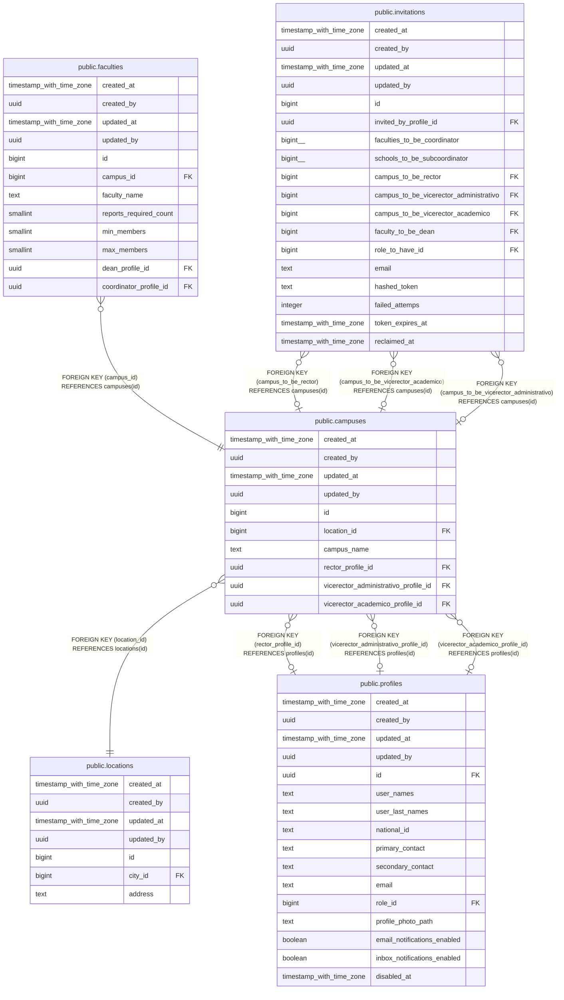

# public.campuses

## Description

## Columns

| Name | Type | Default | Nullable | Children | Parents | Comment |
| ---- | ---- | ------- | -------- | -------- | ------- | ------- |
| created_at | timestamp with time zone | now() | false |  |  |  |
| created_by | uuid | auth.uid() | false |  |  |  |
| updated_at | timestamp with time zone | now() | false |  |  |  |
| updated_by | uuid | auth.uid() | true |  |  |  |
| id | bigint |  | false | [public.faculties](public.faculties.md) [public.invitations](public.invitations.md) |  |  |
| location_id | bigint |  | false |  | [public.locations](public.locations.md) |  |
| campus_name | text |  | false |  |  |  |
| rector_profile_id | uuid |  | true |  | [public.profiles](public.profiles.md) |  |
| vicerector_administrativo_profile_id | uuid |  | true |  | [public.profiles](public.profiles.md) |  |
| vicerector_academico_profile_id | uuid |  | true |  | [public.profiles](public.profiles.md) |  |

## Constraints

| Name | Type | Definition |
| ---- | ---- | ---------- |
| campuses_rector_profile_id_fkey | FOREIGN KEY | FOREIGN KEY (rector_profile_id) REFERENCES profiles(id) |
| campuses_vicerector_academico_profile_id_fkey | FOREIGN KEY | FOREIGN KEY (vicerector_academico_profile_id) REFERENCES profiles(id) |
| campuses_vicerector_administrativo_profile_id_fkey | FOREIGN KEY | FOREIGN KEY (vicerector_administrativo_profile_id) REFERENCES profiles(id) |
| campuses_location_id_fkey | FOREIGN KEY | FOREIGN KEY (location_id) REFERENCES locations(id) |
| campuses_pkey | PRIMARY KEY | PRIMARY KEY (id) |
| campuses_campus_name_key | UNIQUE | UNIQUE (campus_name) |

## Indexes

| Name | Definition |
| ---- | ---------- |
| campuses_pkey | CREATE UNIQUE INDEX campuses_pkey ON public.campuses USING btree (id) |
| campuses_campus_name_key | CREATE UNIQUE INDEX campuses_campus_name_key ON public.campuses USING btree (campus_name) |

## Triggers

| Name | Definition |
| ---- | ---------- |
| audit_campuses_changes | CREATE TRIGGER audit_campuses_changes AFTER INSERT OR DELETE OR UPDATE ON public.campuses FOR EACH ROW EXECUTE FUNCTION log_changes() |
| trg_audit_update_campuses | CREATE TRIGGER trg_audit_update_campuses BEFORE UPDATE ON public.campuses FOR EACH ROW EXECUTE FUNCTION handle_audit_update() |

## Relations

```mermaid
erDiagram

"public.faculties" }o--|| "public.campuses" : "FOREIGN KEY (campus_id) REFERENCES campuses(id)"
"public.invitations" }o--o| "public.campuses" : "FOREIGN KEY (campus_to_be_rector) REFERENCES campuses(id)"
"public.invitations" }o--o| "public.campuses" : "FOREIGN KEY (campus_to_be_vicerector_academico) REFERENCES campuses(id)"
"public.invitations" }o--o| "public.campuses" : "FOREIGN KEY (campus_to_be_vicerector_administrativo) REFERENCES campuses(id)"
"public.campuses" }o--|| "public.locations" : "FOREIGN KEY (location_id) REFERENCES locations(id)"
"public.campuses" }o--o| "public.profiles" : "FOREIGN KEY (rector_profile_id) REFERENCES profiles(id)"
"public.campuses" }o--o| "public.profiles" : "FOREIGN KEY (vicerector_administrativo_profile_id) REFERENCES profiles(id)"
"public.campuses" }o--o| "public.profiles" : "FOREIGN KEY (vicerector_academico_profile_id) REFERENCES profiles(id)"

"public.campuses" {
  timestamp_with_time_zone created_at ""
  uuid created_by ""
  timestamp_with_time_zone updated_at ""
  uuid updated_by ""
  bigint id ""
  bigint location_id FK ""
  text campus_name ""
  uuid rector_profile_id FK ""
  uuid vicerector_administrativo_profile_id FK ""
  uuid vicerector_academico_profile_id FK ""
}
"public.faculties" {
  timestamp_with_time_zone created_at ""
  uuid created_by ""
  timestamp_with_time_zone updated_at ""
  uuid updated_by ""
  bigint id ""
  bigint campus_id FK ""
  text faculty_name ""
  smallint reports_required_count ""
  smallint min_members ""
  smallint max_members ""
  uuid dean_profile_id FK ""
  uuid coordinator_profile_id FK ""
}
"public.invitations" {
  timestamp_with_time_zone created_at ""
  uuid created_by ""
  timestamp_with_time_zone updated_at ""
  uuid updated_by ""
  bigint id ""
  uuid invited_by_profile_id FK ""
  bigint__ faculties_to_be_coordinator ""
  bigint__ schools_to_be_subcoordinator ""
  bigint campus_to_be_rector FK ""
  bigint campus_to_be_vicerector_administrativo FK ""
  bigint campus_to_be_vicerector_academico FK ""
  bigint faculty_to_be_dean FK ""
  bigint role_to_have_id FK ""
  text email ""
  text hashed_token ""
  integer failed_attemps ""
  timestamp_with_time_zone token_expires_at ""
  timestamp_with_time_zone reclaimed_at ""
}
"public.locations" {
  timestamp_with_time_zone created_at ""
  uuid created_by ""
  timestamp_with_time_zone updated_at ""
  uuid updated_by ""
  bigint id ""
  bigint city_id FK ""
  text address ""
}
"public.profiles" {
  timestamp_with_time_zone created_at ""
  uuid created_by ""
  timestamp_with_time_zone updated_at ""
  uuid updated_by ""
  uuid id FK ""
  text user_names ""
  text user_last_names ""
  text national_id ""
  text primary_contact ""
  text secondary_contact ""
  text email ""
  bigint role_id FK ""
  text profile_photo_path ""
  boolean email_notifications_enabled ""
  boolean inbox_notifications_enabled ""
  timestamp_with_time_zone disabled_at ""
}
```

---

> Generated by [tbls](https://github.com/k1LoW/tbls)
