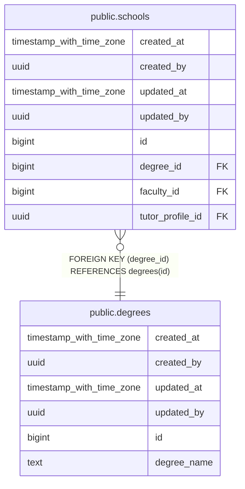

# public.degrees

## Description

## Columns

| Name | Type | Default | Nullable | Children | Parents | Comment |
| ---- | ---- | ------- | -------- | -------- | ------- | ------- |
| created_at | timestamp with time zone | now() | false |  |  |  |
| created_by | uuid | auth.uid() | false |  |  |  |
| updated_at | timestamp with time zone | now() | false |  |  |  |
| updated_by | uuid | auth.uid() | true |  |  |  |
| id | bigint |  | false | [public.schools](public.schools.md) |  |  |
| degree_name | text |  | false |  |  |  |

## Constraints

| Name | Type | Definition |
| ---- | ---- | ---------- |
| degrees_pkey | PRIMARY KEY | PRIMARY KEY (id) |
| degrees_degree_name_key | UNIQUE | UNIQUE (degree_name) |

## Indexes

| Name | Definition |
| ---- | ---------- |
| degrees_pkey | CREATE UNIQUE INDEX degrees_pkey ON public.degrees USING btree (id) |
| degrees_degree_name_key | CREATE UNIQUE INDEX degrees_degree_name_key ON public.degrees USING btree (degree_name) |

## Triggers

| Name | Definition |
| ---- | ---------- |
| audit_degrees_changes | CREATE TRIGGER audit_degrees_changes AFTER INSERT OR DELETE OR UPDATE ON public.degrees FOR EACH ROW EXECUTE FUNCTION log_changes() |
| trg_audit_update_degrees | CREATE TRIGGER trg_audit_update_degrees BEFORE UPDATE ON public.degrees FOR EACH ROW EXECUTE FUNCTION handle_audit_update() |

## Relations

---

> Generated by [tbls](https://github.com/k1LoW/tbls)
