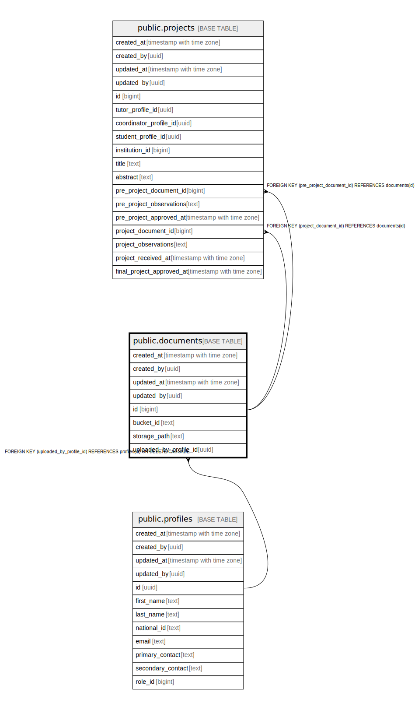

# public.documents

## Description

## Columns

| Name | Type | Default | Nullable | Children | Parents | Comment |
| ---- | ---- | ------- | -------- | -------- | ------- | ------- |
| created_at | timestamp with time zone | now() | false |  |  |  |
| created_by | uuid | auth.uid() | false |  |  |  |
| updated_at | timestamp with time zone | now() | false |  |  |  |
| updated_by | uuid | auth.uid() | true |  |  |  |
| id | bigint |  | false | [public.projects](public.projects.md) |  |  |
| bucket_id | text | 'project'::text | false |  |  |  |
| storage_path | text |  | false |  |  |  |
| uploaded_by_profile_id | uuid |  | false |  | [public.profiles](public.profiles.md) |  |

## Constraints

| Name | Type | Definition |
| ---- | ---- | ---------- |
| documents_bucket_id_fkey | FOREIGN KEY | FOREIGN KEY (bucket_id) REFERENCES storage.buckets(id) |
| documents_uploaded_by_profile_id_fkey | FOREIGN KEY | FOREIGN KEY (uploaded_by_profile_id) REFERENCES profiles(id) ON DELETE CASCADE |
| documents_pkey | PRIMARY KEY | PRIMARY KEY (id) |
| documents_bucket_id_storage_path_key | UNIQUE | UNIQUE (bucket_id, storage_path) |

## Indexes

| Name | Definition |
| ---- | ---------- |
| documents_pkey | CREATE UNIQUE INDEX documents_pkey ON public.documents USING btree (id) |
| documents_bucket_id_storage_path_key | CREATE UNIQUE INDEX documents_bucket_id_storage_path_key ON public.documents USING btree (bucket_id, storage_path) |

## Triggers

| Name | Definition |
| ---- | ---------- |
| trg_audit_update_documents | CREATE TRIGGER trg_audit_update_documents BEFORE UPDATE ON public.documents FOR EACH ROW EXECUTE FUNCTION handle_audit_update() |
| audit_documents_changes | CREATE TRIGGER audit_documents_changes AFTER INSERT OR DELETE OR UPDATE ON public.documents FOR EACH ROW EXECUTE FUNCTION log_changes() |

## Relations

---

> Generated by [tbls](https://github.com/k1LoW/tbls)
