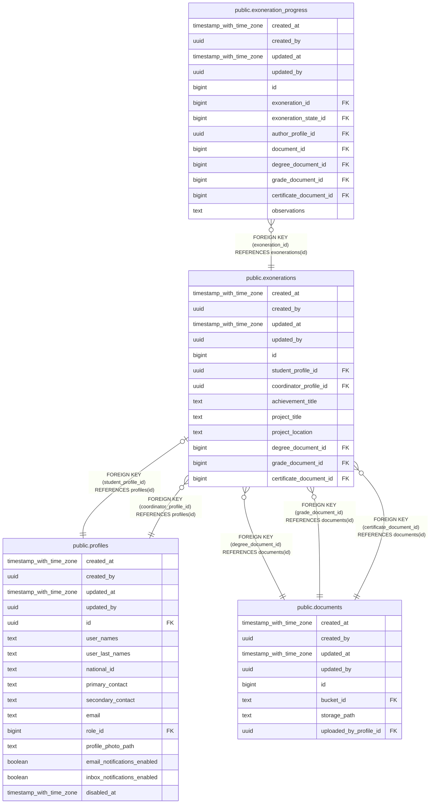

# public.exonerations

## Description

## Columns

| Name | Type | Default | Nullable | Children | Parents | Comment |
| ---- | ---- | ------- | -------- | -------- | ------- | ------- |
| created_at | timestamp with time zone | now() | false |  |  |  |
| created_by | uuid | auth.uid() | false |  |  |  |
| updated_at | timestamp with time zone | now() | false |  |  |  |
| updated_by | uuid | auth.uid() | true |  |  |  |
| id | bigint |  | false | [public.exoneration_progress](public.exoneration_progress.md) |  |  |
| student_profile_id | uuid |  | false |  | [public.profiles](public.profiles.md) |  |
| coordinator_profile_id | uuid |  | false |  | [public.profiles](public.profiles.md) |  |
| achievement_title | text |  | true |  |  |  |
| project_title | text |  | false |  |  |  |
| project_location | text |  | false |  |  |  |
| degree_document_id | bigint |  | false |  | [public.documents](public.documents.md) |  |
| grade_document_id | bigint |  | false |  | [public.documents](public.documents.md) |  |
| certificate_document_id | bigint |  | false |  | [public.documents](public.documents.md) |  |

## Constraints

| Name | Type | Definition |
| ---- | ---- | ---------- |
| exonerations_coordinator_profile_id_fkey | FOREIGN KEY | FOREIGN KEY (coordinator_profile_id) REFERENCES profiles(id) |
| exonerations_student_profile_id_fkey | FOREIGN KEY | FOREIGN KEY (student_profile_id) REFERENCES profiles(id) |
| exonerations_certificate_document_id_fkey | FOREIGN KEY | FOREIGN KEY (certificate_document_id) REFERENCES documents(id) |
| exonerations_degree_document_id_fkey | FOREIGN KEY | FOREIGN KEY (degree_document_id) REFERENCES documents(id) |
| exonerations_grade_document_id_fkey | FOREIGN KEY | FOREIGN KEY (grade_document_id) REFERENCES documents(id) |
| exonerations_pkey | PRIMARY KEY | PRIMARY KEY (id) |
| exonerations_student_profile_id_unique | UNIQUE | UNIQUE (student_profile_id) |

## Indexes

| Name | Definition |
| ---- | ---------- |
| exonerations_pkey | CREATE UNIQUE INDEX exonerations_pkey ON public.exonerations USING btree (id) |
| exonerations_student_profile_id_unique | CREATE UNIQUE INDEX exonerations_student_profile_id_unique ON public.exonerations USING btree (student_profile_id) |

## Triggers

| Name | Definition |
| ---- | ---------- |
| a_set_exoneration_staff_on_insert | CREATE TRIGGER a_set_exoneration_staff_on_insert BEFORE INSERT ON public.exonerations FOR EACH ROW EXECUTE FUNCTION set_exoneration_staff_on_insert() |
| a_validate_exoneration_no_project | CREATE TRIGGER a_validate_exoneration_no_project BEFORE INSERT OR UPDATE ON public.exonerations FOR EACH ROW EXECUTE FUNCTION validate_exoneration_no_project() |
| audit_exonerations_changes | CREATE TRIGGER audit_exonerations_changes AFTER INSERT OR DELETE OR UPDATE ON public.exonerations FOR EACH ROW EXECUTE FUNCTION log_changes() |
| trg_audit_update_exonerations | CREATE TRIGGER trg_audit_update_exonerations BEFORE UPDATE ON public.exonerations FOR EACH ROW EXECUTE FUNCTION handle_audit_update() |

## Relations

---

> Generated by [tbls](https://github.com/k1LoW/tbls)
