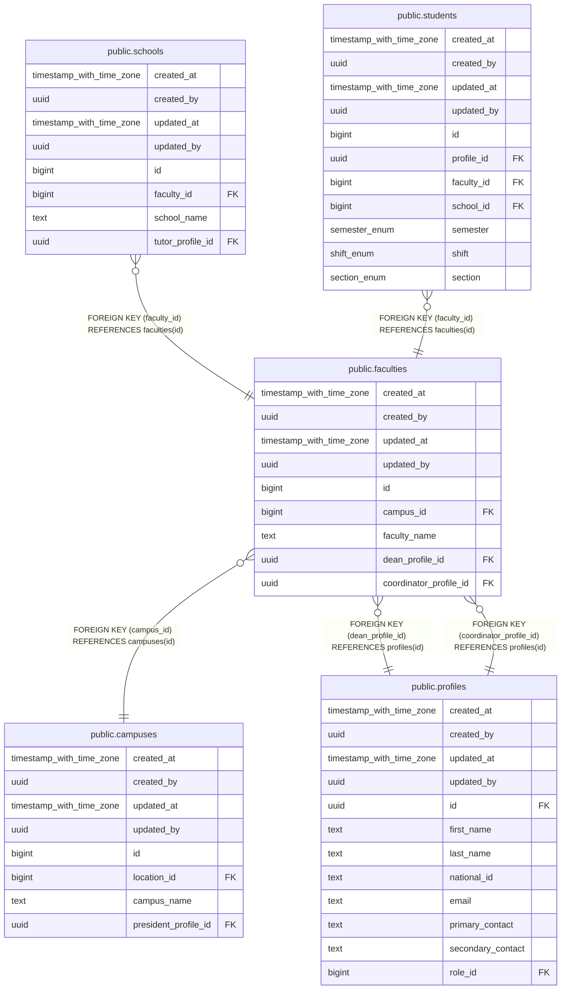

# public.faculties

## Description

## Columns

| Name | Type | Default | Nullable | Children | Parents | Comment |
| ---- | ---- | ------- | -------- | -------- | ------- | ------- |
| created_at | timestamp with time zone | now() | false |  |  |  |
| created_by | uuid | auth.uid() | false |  |  |  |
| updated_at | timestamp with time zone | now() | false |  |  |  |
| updated_by | uuid | auth.uid() | true |  |  |  |
| id | bigint |  | false | [public.schools](public.schools.md) [public.students](public.students.md) |  |  |
| campus_id | bigint |  | false |  | [public.campuses](public.campuses.md) |  |
| faculty_name | text |  | false |  |  |  |
| dean_profile_id | uuid |  | false |  | [public.profiles](public.profiles.md) |  |
| coordinator_profile_id | uuid |  | false |  | [public.profiles](public.profiles.md) |  |

## Constraints

| Name | Type | Definition |
| ---- | ---- | ---------- |
| faculties_coordinator_profile_id_fkey | FOREIGN KEY | FOREIGN KEY (coordinator_profile_id) REFERENCES profiles(id) |
| faculties_dean_profile_id_fkey | FOREIGN KEY | FOREIGN KEY (dean_profile_id) REFERENCES profiles(id) |
| faculties_campus_id_fkey | FOREIGN KEY | FOREIGN KEY (campus_id) REFERENCES campuses(id) |
| faculties_pkey | PRIMARY KEY | PRIMARY KEY (id) |
| faculties_faculty_name_key | UNIQUE | UNIQUE (faculty_name) |

## Indexes

| Name | Definition |
| ---- | ---------- |
| faculties_pkey | CREATE UNIQUE INDEX faculties_pkey ON public.faculties USING btree (id) |
| faculties_faculty_name_key | CREATE UNIQUE INDEX faculties_faculty_name_key ON public.faculties USING btree (faculty_name) |

## Triggers

| Name | Definition |
| ---- | ---------- |
| trg_audit_update_faculties | CREATE TRIGGER trg_audit_update_faculties BEFORE UPDATE ON public.faculties FOR EACH ROW EXECUTE FUNCTION handle_audit_update() |
| audit_faculties_changes | CREATE TRIGGER audit_faculties_changes AFTER INSERT OR DELETE OR UPDATE ON public.faculties FOR EACH ROW EXECUTE FUNCTION log_changes() |

## Relations

---

> Generated by [tbls](https://github.com/k1LoW/tbls)
