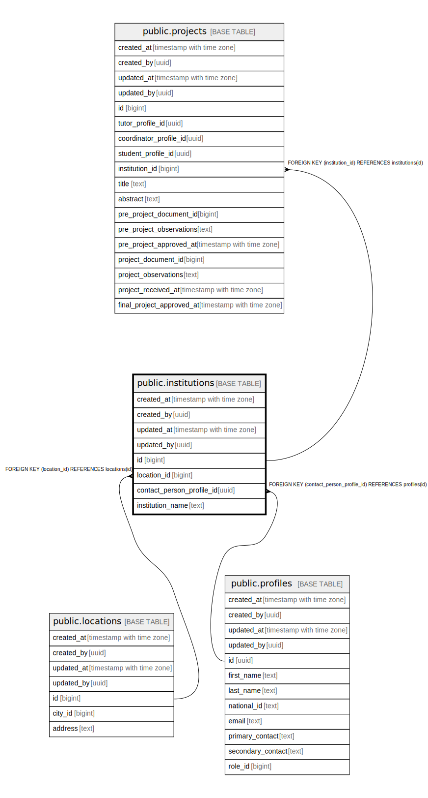

# public.institutions

## Description

## Columns

| Name | Type | Default | Nullable | Children | Parents | Comment |
| ---- | ---- | ------- | -------- | -------- | ------- | ------- |
| created_at | timestamp with time zone | now() | false |  |  |  |
| created_by | uuid | auth.uid() | false |  |  |  |
| updated_at | timestamp with time zone | now() | false |  |  |  |
| updated_by | uuid | auth.uid() | true |  |  |  |
| id | bigint |  | false | [public.projects](public.projects.md) |  |  |
| location_id | bigint |  | true |  | [public.locations](public.locations.md) |  |
| contact_person_profile_id | uuid |  | true |  | [public.profiles](public.profiles.md) |  |
| institution_name | text |  | false |  |  |  |

## Constraints

| Name | Type | Definition |
| ---- | ---- | ---------- |
| institutions_location_id_fkey | FOREIGN KEY | FOREIGN KEY (location_id) REFERENCES locations(id) |
| institutions_contact_person_profile_id_fkey | FOREIGN KEY | FOREIGN KEY (contact_person_profile_id) REFERENCES profiles(id) |
| institutions_pkey | PRIMARY KEY | PRIMARY KEY (id) |
| institutions_institution_name_key | UNIQUE | UNIQUE (institution_name) |

## Indexes

| Name | Definition |
| ---- | ---------- |
| institutions_pkey | CREATE UNIQUE INDEX institutions_pkey ON public.institutions USING btree (id) |
| institutions_institution_name_key | CREATE UNIQUE INDEX institutions_institution_name_key ON public.institutions USING btree (institution_name) |

## Triggers

| Name | Definition |
| ---- | ---------- |
| trg_audit_update_institutions | CREATE TRIGGER trg_audit_update_institutions BEFORE UPDATE ON public.institutions FOR EACH ROW EXECUTE FUNCTION handle_audit_update() |
| audit_institutions_changes | CREATE TRIGGER audit_institutions_changes AFTER INSERT OR DELETE OR UPDATE ON public.institutions FOR EACH ROW EXECUTE FUNCTION log_changes() |

## Relations

---

> Generated by [tbls](https://github.com/k1LoW/tbls)
