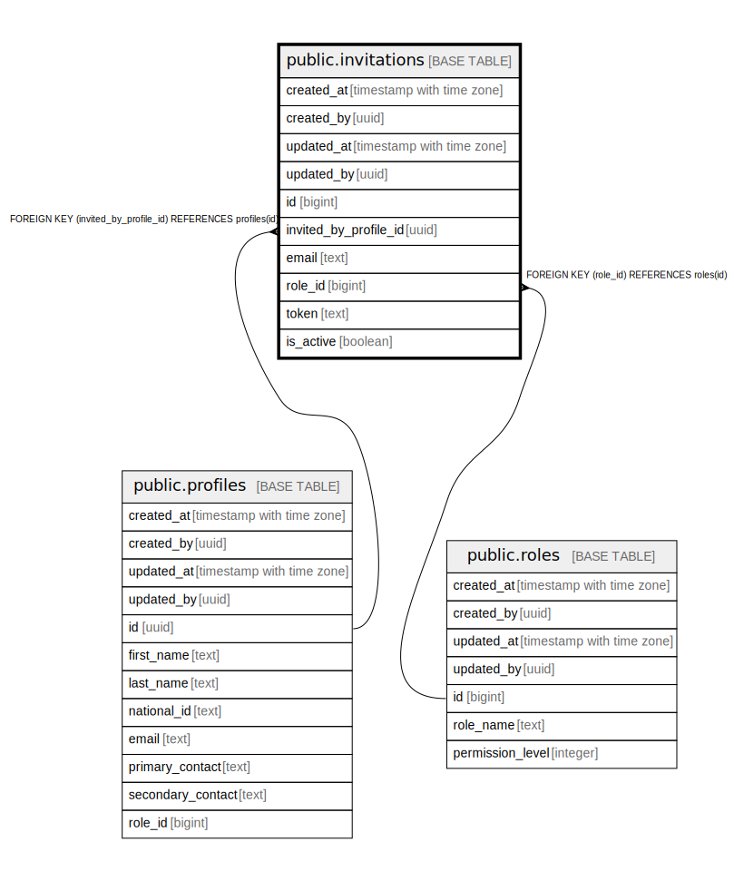

# public.invitations

## Description

## Columns

| Name | Type | Default | Nullable | Children | Parents | Comment |
| ---- | ---- | ------- | -------- | -------- | ------- | ------- |
| created_at | timestamp with time zone | now() | false |  |  |  |
| created_by | uuid | auth.uid() | false |  |  |  |
| updated_at | timestamp with time zone | now() | false |  |  |  |
| updated_by | uuid | auth.uid() | true |  |  |  |
| id | bigint |  | false |  |  |  |
| invited_by_profile_id | uuid |  | true |  | [public.profiles](public.profiles.md) |  |
| email | text |  | false |  |  |  |
| role_id | bigint |  | true |  | [public.roles](public.roles.md) |  |
| token | text |  | false |  |  |  |
| is_active | boolean | true | true |  |  |  |

## Constraints

| Name | Type | Definition |
| ---- | ---- | ---------- |
| invitations_role_id_fkey | FOREIGN KEY | FOREIGN KEY (role_id) REFERENCES roles(id) |
| invitations_invited_by_profile_id_fkey | FOREIGN KEY | FOREIGN KEY (invited_by_profile_id) REFERENCES profiles(id) |
| invitations_pkey | PRIMARY KEY | PRIMARY KEY (id) |
| invitations_email_key | UNIQUE | UNIQUE (email) |

## Indexes

| Name | Definition |
| ---- | ---------- |
| invitations_pkey | CREATE UNIQUE INDEX invitations_pkey ON public.invitations USING btree (id) |
| invitations_email_key | CREATE UNIQUE INDEX invitations_email_key ON public.invitations USING btree (email) |

## Triggers

| Name | Definition |
| ---- | ---------- |
| trg_audit_update_invitations | CREATE TRIGGER trg_audit_update_invitations BEFORE UPDATE ON public.invitations FOR EACH ROW EXECUTE FUNCTION handle_audit_update() |
| audit_invitations_changes | CREATE TRIGGER audit_invitations_changes AFTER INSERT OR DELETE OR UPDATE ON public.invitations FOR EACH ROW EXECUTE FUNCTION log_changes() |

## Relations

---

> Generated by [tbls](https://github.com/k1LoW/tbls)
