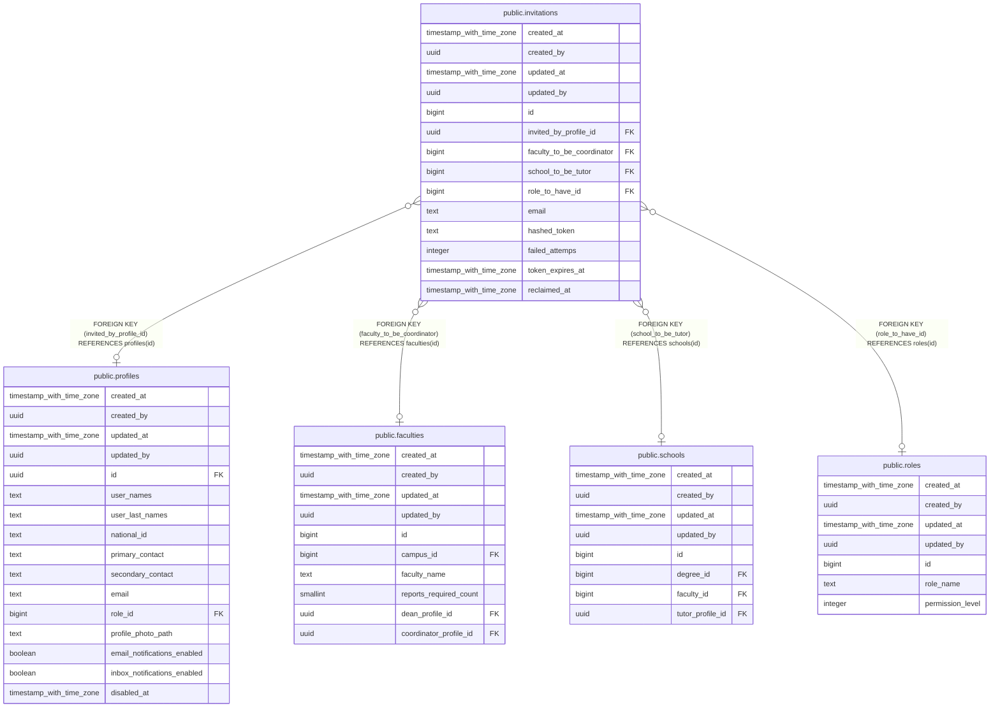

# public.invitations

## Description

## Columns

| Name | Type | Default | Nullable | Children | Parents | Comment |
| ---- | ---- | ------- | -------- | -------- | ------- | ------- |
| created_at | timestamp with time zone | now() | false |  |  |  |
| created_by | uuid | auth.uid() | false |  |  |  |
| updated_at | timestamp with time zone | now() | false |  |  |  |
| updated_by | uuid | auth.uid() | true |  |  |  |
| id | bigint |  | false |  |  |  |
| invited_by_profile_id | uuid |  | true |  | [public.profiles](public.profiles.md) |  |
| faculty_to_be_coordinator | bigint |  | true |  | [public.faculties](public.faculties.md) |  |
| school_to_be_tutor | bigint |  | true |  | [public.schools](public.schools.md) |  |
| role_to_have_id | bigint |  | true |  | [public.roles](public.roles.md) |  |
| email | text |  | false |  |  |  |
| hashed_token | text |  | false |  |  |  |
| failed_attemps | integer | 0 | true |  |  |  |
| token_expires_at | timestamp with time zone | (now() + '1 day'::interval) | true |  |  |  |
| reclaimed_at | timestamp with time zone |  | true |  |  |  |

## Constraints

| Name | Type | Definition |
| ---- | ---- | ---------- |
| invitations_role_to_have_id_fkey | FOREIGN KEY | FOREIGN KEY (role_to_have_id) REFERENCES roles(id) |
| invitations_invited_by_profile_id_fkey | FOREIGN KEY | FOREIGN KEY (invited_by_profile_id) REFERENCES profiles(id) |
| invitations_faculty_to_be_coordinator_fkey | FOREIGN KEY | FOREIGN KEY (faculty_to_be_coordinator) REFERENCES faculties(id) |
| invitations_school_to_be_tutor_fkey | FOREIGN KEY | FOREIGN KEY (school_to_be_tutor) REFERENCES schools(id) |
| invitations_pkey | PRIMARY KEY | PRIMARY KEY (id) |
| invitations_email_key | UNIQUE | UNIQUE (email) |

## Indexes

| Name | Definition |
| ---- | ---------- |
| invitations_pkey | CREATE UNIQUE INDEX invitations_pkey ON public.invitations USING btree (id) |
| invitations_email_key | CREATE UNIQUE INDEX invitations_email_key ON public.invitations USING btree (email) |

## Triggers

| Name | Definition |
| ---- | ---------- |
| a_generate_invitation_token | CREATE TRIGGER a_generate_invitation_token BEFORE INSERT ON public.invitations FOR EACH ROW EXECUTE FUNCTION assign_invitation_token() |
| audit_invitations_changes | CREATE TRIGGER audit_invitations_changes AFTER INSERT OR DELETE OR UPDATE ON public.invitations FOR EACH ROW EXECUTE FUNCTION log_changes() |
| b_set_invited_by_profile_id | CREATE TRIGGER b_set_invited_by_profile_id BEFORE INSERT ON public.invitations FOR EACH ROW EXECUTE FUNCTION set_invited_by_profile_id() |
| trg_audit_update_invitations | CREATE TRIGGER trg_audit_update_invitations BEFORE UPDATE ON public.invitations FOR EACH ROW EXECUTE FUNCTION handle_audit_update() |

## Relations

```mermaid
erDiagram

"public.invitations" }o--o| "public.profiles" : "FOREIGN KEY (invited_by_profile_id) REFERENCES profiles(id)"
"public.invitations" }o--o| "public.faculties" : "FOREIGN KEY (faculty_to_be_coordinator) REFERENCES faculties(id)"
"public.invitations" }o--o| "public.schools" : "FOREIGN KEY (school_to_be_tutor) REFERENCES schools(id)"
"public.invitations" }o--o| "public.roles" : "FOREIGN KEY (role_to_have_id) REFERENCES roles(id)"

"public.invitations" {
  timestamp_with_time_zone created_at ""
  uuid created_by ""
  timestamp_with_time_zone updated_at ""
  uuid updated_by ""
  bigint id ""
  uuid invited_by_profile_id FK ""
  bigint faculty_to_be_coordinator FK ""
  bigint school_to_be_tutor FK ""
  bigint role_to_have_id FK ""
  text email ""
  text hashed_token ""
  integer failed_attemps ""
  timestamp_with_time_zone token_expires_at ""
  timestamp_with_time_zone reclaimed_at ""
}
"public.profiles" {
  timestamp_with_time_zone created_at ""
  uuid created_by ""
  timestamp_with_time_zone updated_at ""
  uuid updated_by ""
  uuid id FK ""
  text user_names ""
  text user_last_names ""
  text national_id ""
  text primary_contact ""
  text secondary_contact ""
  text email ""
  bigint role_id FK ""
  text profile_photo_path ""
  boolean email_notifications_enabled ""
  boolean inbox_notifications_enabled ""
  timestamp_with_time_zone disabled_at ""
}
"public.faculties" {
  timestamp_with_time_zone created_at ""
  uuid created_by ""
  timestamp_with_time_zone updated_at ""
  uuid updated_by ""
  bigint id ""
  bigint campus_id FK ""
  text faculty_name ""
  smallint reports_required_count ""
  uuid dean_profile_id FK ""
  uuid coordinator_profile_id FK ""
}
"public.schools" {
  timestamp_with_time_zone created_at ""
  uuid created_by ""
  timestamp_with_time_zone updated_at ""
  uuid updated_by ""
  bigint id ""
  bigint degree_id FK ""
  bigint faculty_id FK ""
  uuid tutor_profile_id FK ""
}
"public.roles" {
  timestamp_with_time_zone created_at ""
  uuid created_by ""
  timestamp_with_time_zone updated_at ""
  uuid updated_by ""
  bigint id ""
  text role_name ""
  integer permission_level ""
}
```

---

> Generated by [tbls](https://github.com/k1LoW/tbls)
