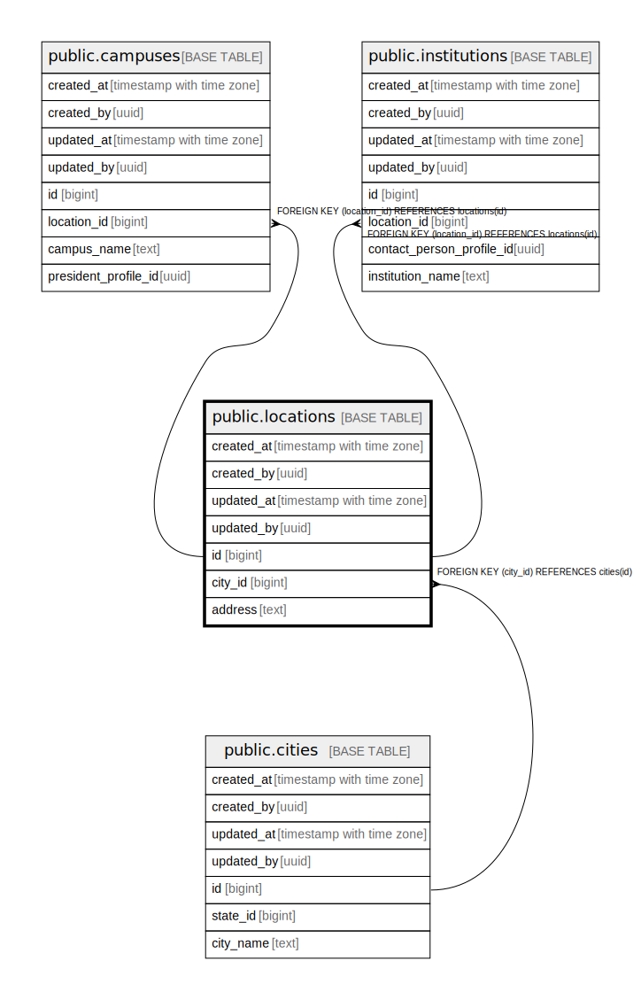

# public.locations

## Description

## Columns

| Name | Type | Default | Nullable | Children | Parents | Comment |
| ---- | ---- | ------- | -------- | -------- | ------- | ------- |
| created_at | timestamp with time zone | now() | false |  |  |  |
| created_by | uuid | auth.uid() | false |  |  |  |
| updated_at | timestamp with time zone | now() | false |  |  |  |
| updated_by | uuid | auth.uid() | true |  |  |  |
| id | bigint |  | false | [public.campuses](public.campuses.md) [public.institutions](public.institutions.md) |  |  |
| city_id | bigint |  | false |  | [public.cities](public.cities.md) |  |
| address | text |  | false |  |  |  |

## Constraints

| Name | Type | Definition |
| ---- | ---- | ---------- |
| locations_city_id_fkey | FOREIGN KEY | FOREIGN KEY (city_id) REFERENCES cities(id) |
| locations_pkey | PRIMARY KEY | PRIMARY KEY (id) |

## Indexes

| Name | Definition |
| ---- | ---------- |
| locations_pkey | CREATE UNIQUE INDEX locations_pkey ON public.locations USING btree (id) |

## Triggers

| Name | Definition |
| ---- | ---------- |
| trg_audit_update_locations | CREATE TRIGGER trg_audit_update_locations BEFORE UPDATE ON public.locations FOR EACH ROW EXECUTE FUNCTION handle_audit_update() |
| audit_locations_changes | CREATE TRIGGER audit_locations_changes AFTER INSERT OR DELETE OR UPDATE ON public.locations FOR EACH ROW EXECUTE FUNCTION log_changes() |

## Relations

---

> Generated by [tbls](https://github.com/k1LoW/tbls)
