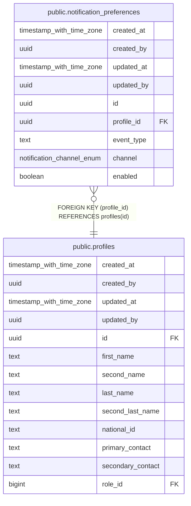

# public.notification_preferences

## Description

## Columns

| Name | Type | Default | Nullable | Children | Parents | Comment |
| ---- | ---- | ------- | -------- | -------- | ------- | ------- |
| created_at | timestamp with time zone | now() | false |  |  |  |
| created_by | uuid | auth.uid() | false |  |  |  |
| updated_at | timestamp with time zone | now() | false |  |  |  |
| updated_by | uuid | auth.uid() | true |  |  |  |
| id | uuid | gen_random_uuid() | false |  |  |  |
| profile_id | uuid |  | false |  | [public.profiles](public.profiles.md) |  |
| event_type | text |  | false |  |  |  |
| channel | notification_channel_enum |  | false |  |  |  |
| enabled | boolean | true | false |  |  |  |

## Constraints

| Name | Type | Definition |
| ---- | ---- | ---------- |
| notification_preferences_profile_id_fkey | FOREIGN KEY | FOREIGN KEY (profile_id) REFERENCES profiles(id) |
| notification_preferences_pkey | PRIMARY KEY | PRIMARY KEY (id) |
| notification_preferences_profile_id_event_type_channel_key | UNIQUE | UNIQUE (profile_id, event_type, channel) |

## Indexes

| Name | Definition |
| ---- | ---------- |
| notification_preferences_pkey | CREATE UNIQUE INDEX notification_preferences_pkey ON public.notification_preferences USING btree (id) |
| notification_preferences_profile_id_event_type_channel_key | CREATE UNIQUE INDEX notification_preferences_profile_id_event_type_channel_key ON public.notification_preferences USING btree (profile_id, event_type, channel) |

## Triggers

| Name | Definition |
| ---- | ---------- |
| trg_audit_update_notification_preferences | CREATE TRIGGER trg_audit_update_notification_preferences BEFORE UPDATE ON public.notification_preferences FOR EACH ROW EXECUTE FUNCTION handle_audit_update() |

## Relations

---

> Generated by [tbls](https://github.com/k1LoW/tbls)
