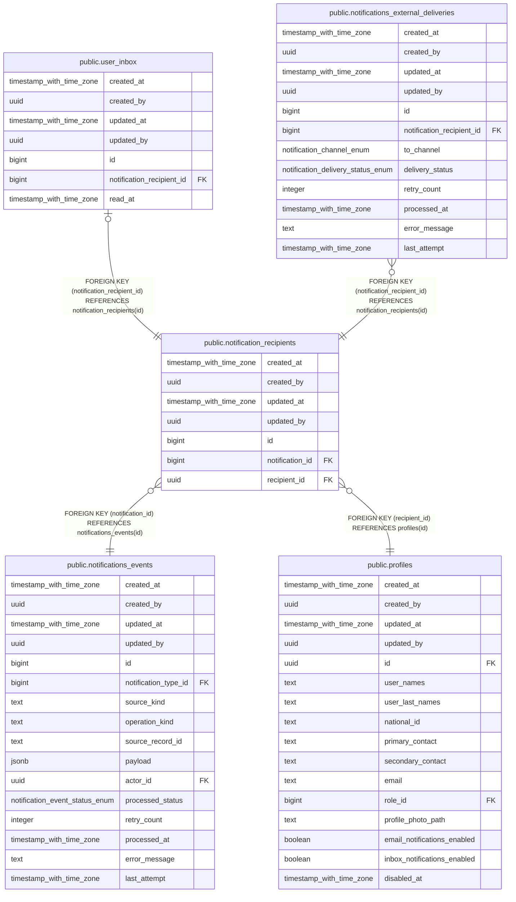

# public.notification_recipients

## Description

## Columns

| Name | Type | Default | Nullable | Children | Parents | Comment |
| ---- | ---- | ------- | -------- | -------- | ------- | ------- |
| created_at | timestamp with time zone | now() | false |  |  |  |
| created_by | uuid | auth.uid() | false |  |  |  |
| updated_at | timestamp with time zone | now() | false |  |  |  |
| updated_by | uuid | auth.uid() | true |  |  |  |
| id | bigint |  | false | [public.user_inbox](public.user_inbox.md) [public.notifications_external_deliveries](public.notifications_external_deliveries.md) |  |  |
| notification_id | bigint |  | false |  | [public.notifications_events](public.notifications_events.md) |  |
| recipient_id | uuid |  | false |  | [public.profiles](public.profiles.md) |  |

## Constraints

| Name | Type | Definition |
| ---- | ---- | ---------- |
| notification_recipients_recipient_id_fkey | FOREIGN KEY | FOREIGN KEY (recipient_id) REFERENCES profiles(id) |
| notification_recipients_notification_id_fkey | FOREIGN KEY | FOREIGN KEY (notification_id) REFERENCES notifications_events(id) |
| notification_recipients_pkey | PRIMARY KEY | PRIMARY KEY (id) |
| notification_recipients_notification_id_recipient_id_key | UNIQUE | UNIQUE (notification_id, recipient_id) |

## Indexes

| Name | Definition |
| ---- | ---------- |
| notification_recipients_pkey | CREATE UNIQUE INDEX notification_recipients_pkey ON public.notification_recipients USING btree (id) |
| notification_recipients_notification_id_recipient_id_key | CREATE UNIQUE INDEX notification_recipients_notification_id_recipient_id_key ON public.notification_recipients USING btree (notification_id, recipient_id) |
| idx_notification_recipients_recipient | CREATE INDEX idx_notification_recipients_recipient ON public.notification_recipients USING btree (recipient_id, created_at) |

## Triggers

| Name | Definition |
| ---- | ---------- |
| audit_notification_recipients_changes | CREATE TRIGGER audit_notification_recipients_changes AFTER INSERT OR DELETE OR UPDATE ON public.notification_recipients FOR EACH ROW EXECUTE FUNCTION log_changes() |
| trg_audit_update_notification_recipients | CREATE TRIGGER trg_audit_update_notification_recipients BEFORE UPDATE ON public.notification_recipients FOR EACH ROW EXECUTE FUNCTION handle_audit_update() |

## Relations

---

> Generated by [tbls](https://github.com/k1LoW/tbls)
