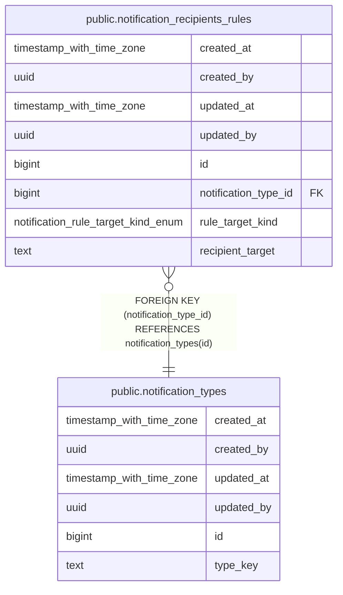

# public.notification_recipients_rules

## Description

## Columns

| Name | Type | Default | Nullable | Children | Parents | Comment |
| ---- | ---- | ------- | -------- | -------- | ------- | ------- |
| created_at | timestamp with time zone | now() | false |  |  |  |
| created_by | uuid | auth.uid() | false |  |  |  |
| updated_at | timestamp with time zone | now() | false |  |  |  |
| updated_by | uuid | auth.uid() | true |  |  |  |
| id | bigint |  | false |  |  |  |
| notification_type_id | bigint |  | false |  | [public.notification_types](public.notification_types.md) |  |
| rule_target_kind | notification_rule_target_kind_enum |  | false |  |  |  |
| recipient_target | text |  | false |  |  |  |

## Constraints

| Name | Type | Definition |
| ---- | ---- | ---------- |
| notification_recipients_rules_notification_type_id_fkey | FOREIGN KEY | FOREIGN KEY (notification_type_id) REFERENCES notification_types(id) |
| notification_recipients_rules_pkey | PRIMARY KEY | PRIMARY KEY (id) |
| notification_recipients_rules_notification_type_id_rule_tar_key | UNIQUE | UNIQUE (notification_type_id, rule_target_kind, recipient_target) |

## Indexes

| Name | Definition |
| ---- | ---------- |
| notification_recipients_rules_pkey | CREATE UNIQUE INDEX notification_recipients_rules_pkey ON public.notification_recipients_rules USING btree (id) |
| notification_recipients_rules_notification_type_id_rule_tar_key | CREATE UNIQUE INDEX notification_recipients_rules_notification_type_id_rule_tar_key ON public.notification_recipients_rules USING btree (notification_type_id, rule_target_kind, recipient_target) |
| idx_notification_recipients_rules_lookup | CREATE INDEX idx_notification_recipients_rules_lookup ON public.notification_recipients_rules USING btree (notification_type_id, rule_target_kind) |

## Triggers

| Name | Definition |
| ---- | ---------- |
| audit_notification_recipients_rules_changes | CREATE TRIGGER audit_notification_recipients_rules_changes AFTER INSERT OR DELETE OR UPDATE ON public.notification_recipients_rules FOR EACH ROW EXECUTE FUNCTION log_changes() |
| trg_audit_update_notification_recipients_rules | CREATE TRIGGER trg_audit_update_notification_recipients_rules BEFORE UPDATE ON public.notification_recipients_rules FOR EACH ROW EXECUTE FUNCTION handle_audit_update() |

## Relations

---

> Generated by [tbls](https://github.com/k1LoW/tbls)
