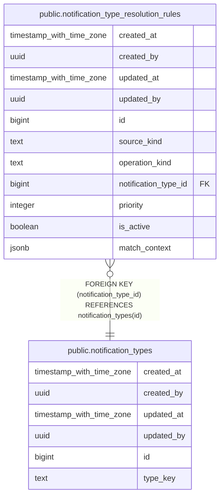

# public.notification_type_resolution_rules

## Description

## Columns

| Name | Type | Default | Nullable | Children | Parents | Comment |
| ---- | ---- | ------- | -------- | -------- | ------- | ------- |
| created_at | timestamp with time zone | now() | false |  |  |  |
| created_by | uuid | auth.uid() | false |  |  |  |
| updated_at | timestamp with time zone | now() | false |  |  |  |
| updated_by | uuid | auth.uid() | true |  |  |  |
| id | bigint |  | false |  |  |  |
| source_kind | text |  | false |  |  |  |
| operation_kind | text |  | false |  |  |  |
| notification_type_id | bigint |  | false |  | [public.notification_types](public.notification_types.md) |  |
| priority | integer | 100 | false |  |  |  |
| is_active | boolean | true | false |  |  |  |
| match_context | jsonb | '{}'::jsonb | false |  |  |  |

## Constraints

| Name | Type | Definition |
| ---- | ---- | ---------- |
| notification_type_resolution_rules_match_context_check | CHECK | CHECK ((jsonb_typeof(match_context) = 'object'::text)) |
| notification_type_resolution_rules_notification_type_id_fkey | FOREIGN KEY | FOREIGN KEY (notification_type_id) REFERENCES notification_types(id) |
| notification_type_resolution_rules_pkey | PRIMARY KEY | PRIMARY KEY (id) |
| notification_type_resolution__source_kind_operation_kind_no_key | UNIQUE | UNIQUE (source_kind, operation_kind, notification_type_id, priority, match_context) |

## Indexes

| Name | Definition |
| ---- | ---------- |
| notification_type_resolution_rules_pkey | CREATE UNIQUE INDEX notification_type_resolution_rules_pkey ON public.notification_type_resolution_rules USING btree (id) |
| notification_type_resolution__source_kind_operation_kind_no_key | CREATE UNIQUE INDEX notification_type_resolution__source_kind_operation_kind_no_key ON public.notification_type_resolution_rules USING btree (source_kind, operation_kind, notification_type_id, priority, match_context) |
| idx_notification_type_resolution_rules_lookup | CREATE INDEX idx_notification_type_resolution_rules_lookup ON public.notification_type_resolution_rules USING btree (source_kind, operation_kind, is_active, priority DESC) |

## Triggers

| Name | Definition |
| ---- | ---------- |
| audit_notification_type_resolution_rules_changes | CREATE TRIGGER audit_notification_type_resolution_rules_changes AFTER INSERT OR DELETE OR UPDATE ON public.notification_type_resolution_rules FOR EACH ROW EXECUTE FUNCTION log_changes() |
| trg_audit_update_notification_type_resolution_rules | CREATE TRIGGER trg_audit_update_notification_type_resolution_rules BEFORE UPDATE ON public.notification_type_resolution_rules FOR EACH ROW EXECUTE FUNCTION handle_audit_update() |

## Relations

---

> Generated by [tbls](https://github.com/k1LoW/tbls)
