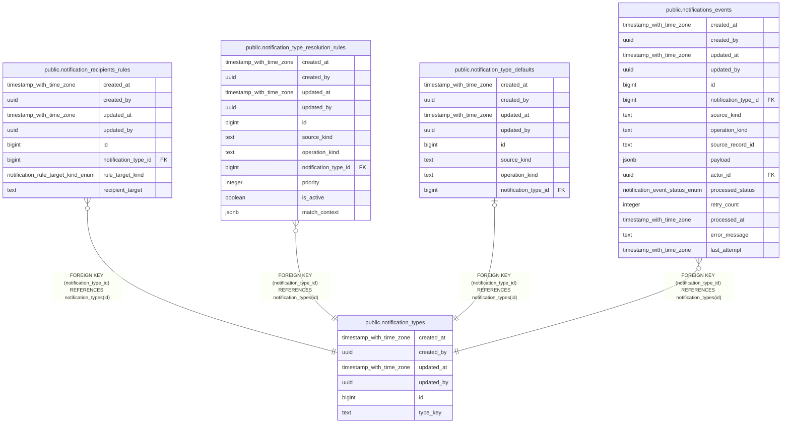

# public.notification_types

## Description

## Columns

| Name | Type | Default | Nullable | Children | Parents | Comment |
| ---- | ---- | ------- | -------- | -------- | ------- | ------- |
| created_at | timestamp with time zone | now() | false |  |  |  |
| created_by | uuid | auth.uid() | false |  |  |  |
| updated_at | timestamp with time zone | now() | false |  |  |  |
| updated_by | uuid | auth.uid() | true |  |  |  |
| id | bigint |  | false | [public.notification_recipients_rules](public.notification_recipients_rules.md) [public.notification_type_resolution_rules](public.notification_type_resolution_rules.md) [public.notification_type_defaults](public.notification_type_defaults.md) [public.notifications_events](public.notifications_events.md) |  |  |
| type_key | text |  | false |  |  |  |

## Constraints

| Name | Type | Definition |
| ---- | ---- | ---------- |
| notification_types_pkey | PRIMARY KEY | PRIMARY KEY (id) |
| notification_types_type_key_key | UNIQUE | UNIQUE (type_key) |

## Indexes

| Name | Definition |
| ---- | ---------- |
| notification_types_pkey | CREATE UNIQUE INDEX notification_types_pkey ON public.notification_types USING btree (id) |
| notification_types_type_key_key | CREATE UNIQUE INDEX notification_types_type_key_key ON public.notification_types USING btree (type_key) |

## Triggers

| Name | Definition |
| ---- | ---------- |
| audit_notification_types_changes | CREATE TRIGGER audit_notification_types_changes AFTER INSERT OR DELETE OR UPDATE ON public.notification_types FOR EACH ROW EXECUTE FUNCTION log_changes() |
| trg_audit_update_notification_types | CREATE TRIGGER trg_audit_update_notification_types BEFORE UPDATE ON public.notification_types FOR EACH ROW EXECUTE FUNCTION handle_audit_update() |

## Relations

---

> Generated by [tbls](https://github.com/k1LoW/tbls)
