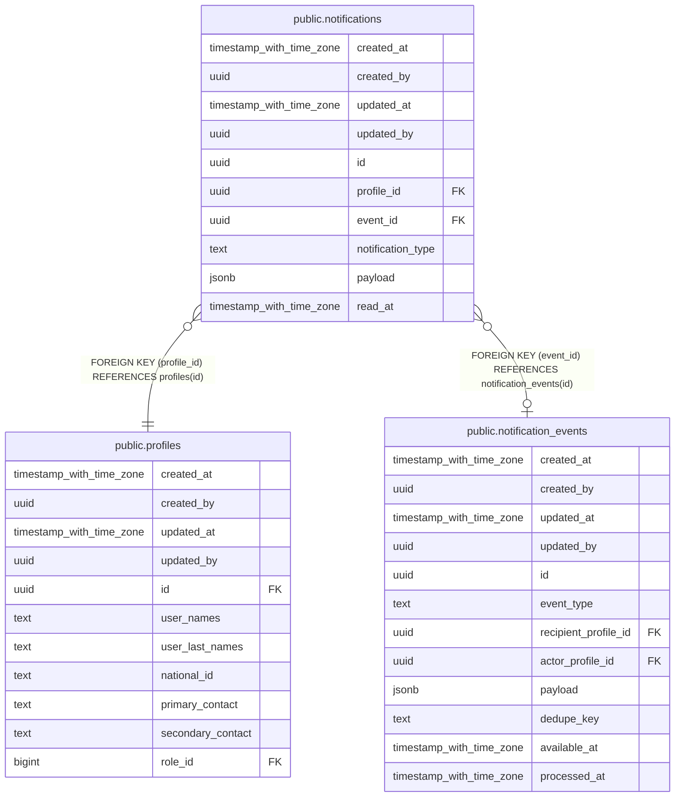

# public.notifications

## Description

## Columns

| Name | Type | Default | Nullable | Children | Parents | Comment |
| ---- | ---- | ------- | -------- | -------- | ------- | ------- |
| created_at | timestamp with time zone | now() | false |  |  |  |
| created_by | uuid | auth.uid() | false |  |  |  |
| updated_at | timestamp with time zone | now() | false |  |  |  |
| updated_by | uuid | auth.uid() | true |  |  |  |
| id | uuid | gen_random_uuid() | false |  |  |  |
| profile_id | uuid |  | false |  | [public.profiles](public.profiles.md) |  |
| event_id | uuid |  | true |  | [public.notification_events](public.notification_events.md) |  |
| notification_type | text |  | false |  |  |  |
| payload | jsonb |  | true |  |  |  |
| read_at | timestamp with time zone |  | true |  |  |  |

## Constraints

| Name | Type | Definition |
| ---- | ---- | ---------- |
| notifications_profile_id_fkey | FOREIGN KEY | FOREIGN KEY (profile_id) REFERENCES profiles(id) |
| notifications_event_id_fkey | FOREIGN KEY | FOREIGN KEY (event_id) REFERENCES notification_events(id) |
| notifications_pkey | PRIMARY KEY | PRIMARY KEY (id) |

## Indexes

| Name | Definition |
| ---- | ---------- |
| notifications_pkey | CREATE UNIQUE INDEX notifications_pkey ON public.notifications USING btree (id) |

## Triggers

| Name | Definition |
| ---- | ---------- |
| trg_audit_update_notifications | CREATE TRIGGER trg_audit_update_notifications BEFORE UPDATE ON public.notifications FOR EACH ROW EXECUTE FUNCTION handle_audit_update() |

## Relations

---

> Generated by [tbls](https://github.com/k1LoW/tbls)
