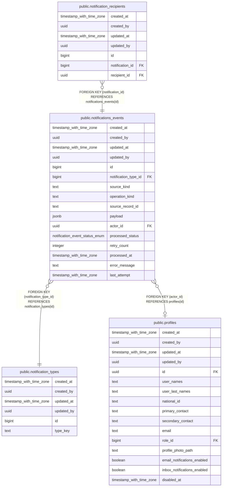

# public.notifications_events

## Description

## Columns

| Name | Type | Default | Nullable | Children | Parents | Comment |
| ---- | ---- | ------- | -------- | -------- | ------- | ------- |
| created_at | timestamp with time zone | now() | false |  |  |  |
| created_by | uuid | auth.uid() | false |  |  |  |
| updated_at | timestamp with time zone | now() | false |  |  |  |
| updated_by | uuid | auth.uid() | true |  |  |  |
| id | bigint |  | false | [public.notification_recipients](public.notification_recipients.md) |  |  |
| notification_type_id | bigint |  | false |  | [public.notification_types](public.notification_types.md) |  |
| source_kind | text |  | false |  |  |  |
| operation_kind | text |  | false |  |  |  |
| source_record_id | text |  | false |  |  |  |
| payload | jsonb |  | false |  |  |  |
| actor_id | uuid |  | true |  | [public.profiles](public.profiles.md) |  |
| processed_status | notification_event_status_enum | 'pending'::notification_event_status_enum | false |  |  |  |
| retry_count | integer | 0 | false |  |  |  |
| processed_at | timestamp with time zone |  | true |  |  |  |
| error_message | text |  | true |  |  |  |
| last_attempt | timestamp with time zone |  | true |  |  |  |

## Constraints

| Name | Type | Definition |
| ---- | ---- | ---------- |
| notifications_events_actor_id_fkey | FOREIGN KEY | FOREIGN KEY (actor_id) REFERENCES profiles(id) |
| notifications_events_notification_type_id_fkey | FOREIGN KEY | FOREIGN KEY (notification_type_id) REFERENCES notification_types(id) |
| notifications_events_pkey | PRIMARY KEY | PRIMARY KEY (id) |

## Indexes

| Name | Definition |
| ---- | ---------- |
| notifications_events_pkey | CREATE UNIQUE INDEX notifications_events_pkey ON public.notifications_events USING btree (id) |
| idx_notifications_events_queue | CREATE INDEX idx_notifications_events_queue ON public.notifications_events USING btree (processed_status, created_at, id) |
| idx_notifications_events_source | CREATE INDEX idx_notifications_events_source ON public.notifications_events USING btree (source_kind, operation_kind, source_record_id) |

## Triggers

| Name | Definition |
| ---- | ---------- |
| a_dispatch_notification_event_now | CREATE TRIGGER a_dispatch_notification_event_now AFTER INSERT ON public.notifications_events FOR EACH STATEMENT EXECUTE FUNCTION dispatch_notification_event_now() |
| audit_notifications_events_changes | CREATE TRIGGER audit_notifications_events_changes AFTER INSERT OR DELETE OR UPDATE ON public.notifications_events FOR EACH ROW EXECUTE FUNCTION log_changes() |
| trg_audit_update_notifications_events | CREATE TRIGGER trg_audit_update_notifications_events BEFORE UPDATE ON public.notifications_events FOR EACH ROW EXECUTE FUNCTION handle_audit_update() |

## Relations

---

> Generated by [tbls](https://github.com/k1LoW/tbls)
