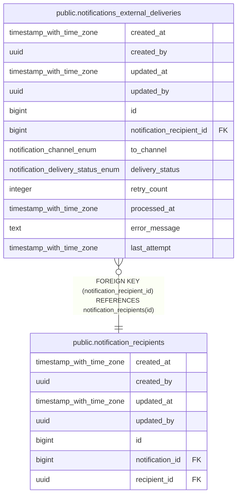

# public.notifications_external_deliveries

## Description

## Columns

| Name | Type | Default | Nullable | Children | Parents | Comment |
| ---- | ---- | ------- | -------- | -------- | ------- | ------- |
| created_at | timestamp with time zone | now() | false |  |  |  |
| created_by | uuid | auth.uid() | false |  |  |  |
| updated_at | timestamp with time zone | now() | false |  |  |  |
| updated_by | uuid | auth.uid() | true |  |  |  |
| id | bigint |  | false |  |  |  |
| notification_recipient_id | bigint |  | false |  | [public.notification_recipients](public.notification_recipients.md) |  |
| to_channel | notification_channel_enum |  | false |  |  |  |
| delivery_status | notification_delivery_status_enum | 'pending'::notification_delivery_status_enum | false |  |  |  |
| retry_count | integer | 0 | false |  |  |  |
| processed_at | timestamp with time zone |  | true |  |  |  |
| error_message | text |  | true |  |  |  |
| last_attempt | timestamp with time zone |  | true |  |  |  |

## Constraints

| Name | Type | Definition |
| ---- | ---- | ---------- |
| notifications_external_deliverie_notification_recipient_id_fkey | FOREIGN KEY | FOREIGN KEY (notification_recipient_id) REFERENCES notification_recipients(id) |
| notifications_external_deliveries_pkey | PRIMARY KEY | PRIMARY KEY (id) |
| notifications_external_delive_notification_recipient_id_to__key | UNIQUE | UNIQUE (notification_recipient_id, to_channel) |

## Indexes

| Name | Definition |
| ---- | ---------- |
| notifications_external_deliveries_pkey | CREATE UNIQUE INDEX notifications_external_deliveries_pkey ON public.notifications_external_deliveries USING btree (id) |
| notifications_external_delive_notification_recipient_id_to__key | CREATE UNIQUE INDEX notifications_external_delive_notification_recipient_id_to__key ON public.notifications_external_deliveries USING btree (notification_recipient_id, to_channel) |
| idx_notifications_external_deliveries_queue | CREATE INDEX idx_notifications_external_deliveries_queue ON public.notifications_external_deliveries USING btree (delivery_status, created_at, id) |

## Triggers

| Name | Definition |
| ---- | ---------- |
| audit_notifications_external_deliveries_changes | CREATE TRIGGER audit_notifications_external_deliveries_changes AFTER INSERT OR DELETE OR UPDATE ON public.notifications_external_deliveries FOR EACH ROW EXECUTE FUNCTION log_changes() |
| trg_audit_update_notifications_external_deliveries | CREATE TRIGGER trg_audit_update_notifications_external_deliveries BEFORE UPDATE ON public.notifications_external_deliveries FOR EACH ROW EXECUTE FUNCTION handle_audit_update() |

## Relations

---

> Generated by [tbls](https://github.com/k1LoW/tbls)
