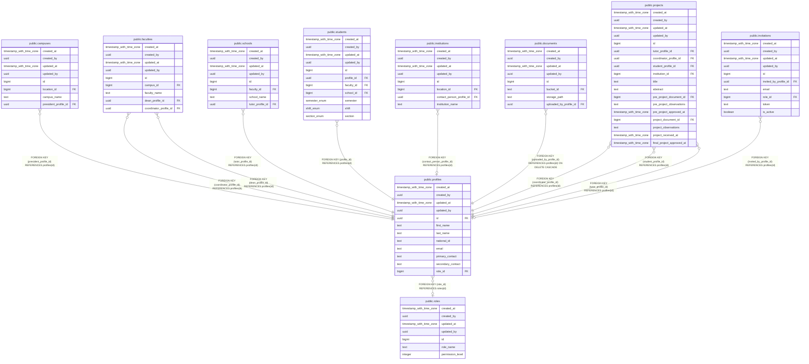

# public.profiles

## Description

## Columns

| Name | Type | Default | Nullable | Children | Parents | Comment |
| ---- | ---- | ------- | -------- | -------- | ------- | ------- |
| created_at | timestamp with time zone | now() | false |  |  |  |
| created_by | uuid | auth.uid() | false |  |  |  |
| updated_at | timestamp with time zone | now() | false |  |  |  |
| updated_by | uuid | auth.uid() | true |  |  |  |
| id | uuid |  | false | [public.campuses](public.campuses.md) [public.faculties](public.faculties.md) [public.schools](public.schools.md) [public.students](public.students.md) [public.institutions](public.institutions.md) [public.documents](public.documents.md) [public.projects](public.projects.md) [public.invitations](public.invitations.md) |  |  |
| first_name | text |  | false |  |  |  |
| last_name | text |  | false |  |  |  |
| national_id | text |  | false |  |  |  |
| email | text |  | false |  |  |  |
| primary_contact | text |  | false |  |  |  |
| secondary_contact | text |  | true |  |  |  |
| role_id | bigint |  | true |  | [public.roles](public.roles.md) |  |

## Constraints

| Name | Type | Definition |
| ---- | ---- | ---------- |
| profiles_id_fkey | FOREIGN KEY | FOREIGN KEY (id) REFERENCES auth.users(id) |
| profiles_role_id_fkey | FOREIGN KEY | FOREIGN KEY (role_id) REFERENCES roles(id) |
| profiles_pkey | PRIMARY KEY | PRIMARY KEY (id) |
| profiles_national_id_key | UNIQUE | UNIQUE (national_id) |
| profiles_email_key | UNIQUE | UNIQUE (email) |

## Indexes

| Name | Definition |
| ---- | ---------- |
| profiles_pkey | CREATE UNIQUE INDEX profiles_pkey ON public.profiles USING btree (id) |
| profiles_national_id_key | CREATE UNIQUE INDEX profiles_national_id_key ON public.profiles USING btree (national_id) |
| profiles_email_key | CREATE UNIQUE INDEX profiles_email_key ON public.profiles USING btree (email) |

## Triggers

| Name | Definition |
| ---- | ---------- |
| trg_audit_update_profiles | CREATE TRIGGER trg_audit_update_profiles BEFORE UPDATE ON public.profiles FOR EACH ROW EXECUTE FUNCTION handle_audit_update() |
| audit_profiles_changes | CREATE TRIGGER audit_profiles_changes AFTER INSERT OR DELETE OR UPDATE ON public.profiles FOR EACH ROW EXECUTE FUNCTION log_changes() |

## Relations

---

> Generated by [tbls](https://github.com/k1LoW/tbls)
