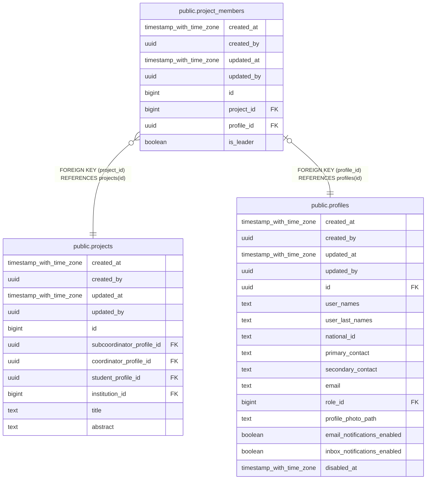

# public.project_members

## Description

## Columns

| Name | Type | Default | Nullable | Children | Parents | Comment |
| ---- | ---- | ------- | -------- | -------- | ------- | ------- |
| created_at | timestamp with time zone | now() | false |  |  |  |
| created_by | uuid | auth.uid() | false |  |  |  |
| updated_at | timestamp with time zone | now() | false |  |  |  |
| updated_by | uuid | auth.uid() | true |  |  |  |
| id | bigint |  | false |  |  |  |
| project_id | bigint |  | false |  | [public.projects](public.projects.md) |  |
| profile_id | uuid |  | false |  | [public.profiles](public.profiles.md) |  |
| is_leader | boolean | false | false |  |  |  |

## Constraints

| Name | Type | Definition |
| ---- | ---- | ---------- |
| project_members_profile_id_fkey | FOREIGN KEY | FOREIGN KEY (profile_id) REFERENCES profiles(id) |
| project_members_project_id_fkey | FOREIGN KEY | FOREIGN KEY (project_id) REFERENCES projects(id) |
| project_members_pkey | PRIMARY KEY | PRIMARY KEY (id) |
| project_members_project_id_profile_id_key | UNIQUE | UNIQUE (project_id, profile_id) |
| project_members_profile_id_key | UNIQUE | UNIQUE (profile_id) |

## Indexes

| Name | Definition |
| ---- | ---------- |
| project_members_pkey | CREATE UNIQUE INDEX project_members_pkey ON public.project_members USING btree (id) |
| project_members_project_id_profile_id_key | CREATE UNIQUE INDEX project_members_project_id_profile_id_key ON public.project_members USING btree (project_id, profile_id) |
| project_members_profile_id_key | CREATE UNIQUE INDEX project_members_profile_id_key ON public.project_members USING btree (profile_id) |
| idx_project_members_one_leader | CREATE UNIQUE INDEX idx_project_members_one_leader ON public.project_members USING btree (project_id) WHERE (is_leader = true) |

## Triggers

| Name | Definition |
| ---- | ---------- |
| a_validate_project_member_limits | CREATE TRIGGER a_validate_project_member_limits BEFORE INSERT OR DELETE OR UPDATE ON public.project_members FOR EACH ROW EXECUTE FUNCTION validate_project_member_limits() |
| audit_project_members_changes | CREATE TRIGGER audit_project_members_changes AFTER INSERT OR DELETE OR UPDATE ON public.project_members FOR EACH ROW EXECUTE FUNCTION log_changes() |
| trg_audit_update_project_members | CREATE TRIGGER trg_audit_update_project_members BEFORE UPDATE ON public.project_members FOR EACH ROW EXECUTE FUNCTION handle_audit_update() |

## Relations

---

> Generated by [tbls](https://github.com/k1LoW/tbls)
