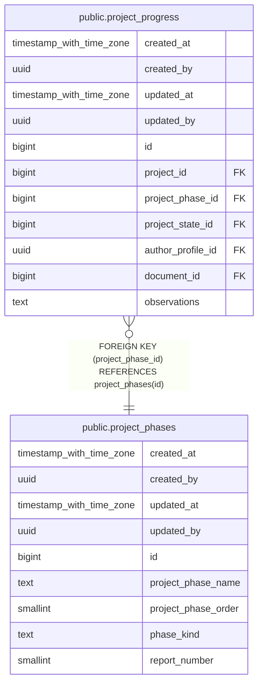

# public.project_phases

## Description

## Columns

| Name | Type | Default | Nullable | Children | Parents | Comment |
| ---- | ---- | ------- | -------- | -------- | ------- | ------- |
| created_at | timestamp with time zone | now() | false |  |  |  |
| created_by | uuid | auth.uid() | false |  |  |  |
| updated_at | timestamp with time zone | now() | false |  |  |  |
| updated_by | uuid | auth.uid() | true |  |  |  |
| id | bigint |  | false | [public.project_progress](public.project_progress.md) |  |  |
| project_phase_name | text |  | false |  |  |  |
| project_phase_order | smallint |  | false |  |  |  |
| phase_kind | text |  | false |  |  |  |
| report_number | smallint |  | true |  |  |  |

## Constraints

| Name | Type | Definition |
| ---- | ---- | ---------- |
| project_phases_check | CHECK | CHECK ((((phase_kind = 'report'::text) AND (report_number IS NOT NULL) AND ((report_number >= 1) AND (report_number <= 10))) OR ((phase_kind <> 'report'::text) AND (report_number IS NULL)))) |
| project_phases_phase_kind_check | CHECK | CHECK ((phase_kind = ANY (ARRAY['preproject'::text, 'report'::text, 'final_report'::text, 'approved'::text]))) |
| project_phases_pkey | PRIMARY KEY | PRIMARY KEY (id) |
| project_phases_project_phase_name_key | UNIQUE | UNIQUE (project_phase_name) |
| project_phases_project_phase_order_key | UNIQUE | UNIQUE (project_phase_order) |

## Indexes

| Name | Definition |
| ---- | ---------- |
| project_phases_pkey | CREATE UNIQUE INDEX project_phases_pkey ON public.project_phases USING btree (id) |
| project_phases_project_phase_name_key | CREATE UNIQUE INDEX project_phases_project_phase_name_key ON public.project_phases USING btree (project_phase_name) |
| project_phases_project_phase_order_key | CREATE UNIQUE INDEX project_phases_project_phase_order_key ON public.project_phases USING btree (project_phase_order) |

## Triggers

| Name | Definition |
| ---- | ---------- |
| audit_project_phases_changes | CREATE TRIGGER audit_project_phases_changes AFTER INSERT OR DELETE OR UPDATE ON public.project_phases FOR EACH ROW EXECUTE FUNCTION log_changes() |
| trg_audit_update_project_phases | CREATE TRIGGER trg_audit_update_project_phases BEFORE UPDATE ON public.project_phases FOR EACH ROW EXECUTE FUNCTION handle_audit_update() |

## Relations

---

> Generated by [tbls](https://github.com/k1LoW/tbls)
