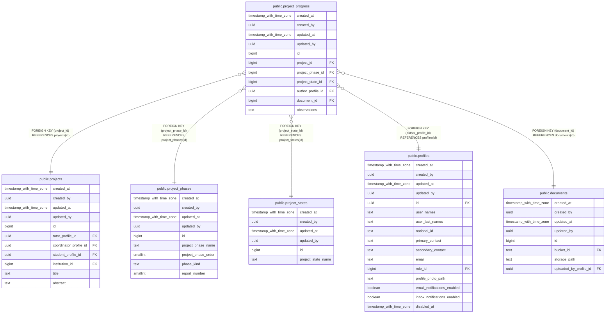

# public.project_progress

## Description

## Columns

| Name | Type | Default | Nullable | Children | Parents | Comment |
| ---- | ---- | ------- | -------- | -------- | ------- | ------- |
| created_at | timestamp with time zone | now() | false |  |  |  |
| created_by | uuid | auth.uid() | false |  |  |  |
| updated_at | timestamp with time zone | now() | false |  |  |  |
| updated_by | uuid | auth.uid() | true |  |  |  |
| id | bigint |  | false |  |  |  |
| project_id | bigint |  | false |  | [public.projects](public.projects.md) |  |
| project_phase_id | bigint |  | false |  | [public.project_phases](public.project_phases.md) |  |
| project_state_id | bigint |  | false |  | [public.project_states](public.project_states.md) |  |
| author_profile_id | uuid |  | false |  | [public.profiles](public.profiles.md) |  |
| document_id | bigint |  | false |  | [public.documents](public.documents.md) |  |
| observations | text |  | true |  |  |  |

## Constraints

| Name | Type | Definition |
| ---- | ---- | ---------- |
| project_progress_author_profile_id_fkey | FOREIGN KEY | FOREIGN KEY (author_profile_id) REFERENCES profiles(id) |
| project_progress_document_id_fkey | FOREIGN KEY | FOREIGN KEY (document_id) REFERENCES documents(id) |
| project_progress_project_phase_id_fkey | FOREIGN KEY | FOREIGN KEY (project_phase_id) REFERENCES project_phases(id) |
| project_progress_project_state_id_fkey | FOREIGN KEY | FOREIGN KEY (project_state_id) REFERENCES project_states(id) |
| project_progress_project_id_fkey | FOREIGN KEY | FOREIGN KEY (project_id) REFERENCES projects(id) |
| project_progress_pkey | PRIMARY KEY | PRIMARY KEY (id) |

## Indexes

| Name | Definition |
| ---- | ---------- |
| project_progress_pkey | CREATE UNIQUE INDEX project_progress_pkey ON public.project_progress USING btree (id) |
| idx_project_progress_project_created | CREATE INDEX idx_project_progress_project_created ON public.project_progress USING btree (project_id, created_at DESC, id DESC) |

## Triggers

| Name | Definition |
| ---- | ---------- |
| audit_project_progress_changes | CREATE TRIGGER audit_project_progress_changes AFTER INSERT OR DELETE OR UPDATE ON public.project_progress FOR EACH ROW EXECUTE FUNCTION log_changes() |
| b_enqueue_project_progress_notification_event | CREATE TRIGGER b_enqueue_project_progress_notification_event AFTER INSERT ON public.project_progress FOR EACH ROW EXECUTE FUNCTION enqueue_project_progress_notification_event() |
| b_validate_project_progress_phase_transition | CREATE TRIGGER b_validate_project_progress_phase_transition BEFORE INSERT ON public.project_progress FOR EACH ROW EXECUTE FUNCTION validate_project_progress_phase_transition() |
| trg_audit_update_project_progress | CREATE TRIGGER trg_audit_update_project_progress BEFORE UPDATE ON public.project_progress FOR EACH ROW EXECUTE FUNCTION handle_audit_update() |

## Relations

---

> Generated by [tbls](https://github.com/k1LoW/tbls)
