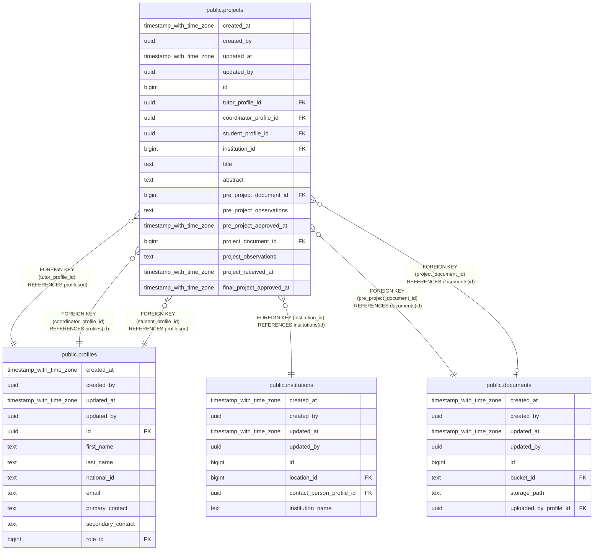

# public.projects

## Description

## Columns

| Name | Type | Default | Nullable | Children | Parents | Comment |
| ---- | ---- | ------- | -------- | -------- | ------- | ------- |
| created_at | timestamp with time zone | now() | false |  |  |  |
| created_by | uuid | auth.uid() | false |  |  |  |
| updated_at | timestamp with time zone | now() | false |  |  |  |
| updated_by | uuid | auth.uid() | true |  |  |  |
| id | bigint |  | false |  |  |  |
| tutor_profile_id | uuid |  | false |  | [public.profiles](public.profiles.md) |  |
| coordinator_profile_id | uuid |  | false |  | [public.profiles](public.profiles.md) |  |
| student_profile_id | uuid |  | false |  | [public.profiles](public.profiles.md) |  |
| institution_id | bigint |  | false |  | [public.institutions](public.institutions.md) |  |
| title | text |  | false |  |  |  |
| abstract | text |  | true |  |  |  |
| pre_project_document_id | bigint |  | false |  | [public.documents](public.documents.md) |  |
| pre_project_observations | text |  | true |  |  |  |
| pre_project_approved_at | timestamp with time zone |  | true |  |  |  |
| project_document_id | bigint |  | true |  | [public.documents](public.documents.md) |  |
| project_observations | text |  | true |  |  |  |
| project_received_at | timestamp with time zone |  | true |  |  |  |
| final_project_approved_at | timestamp with time zone |  | true |  |  |  |

## Constraints

| Name | Type | Definition |
| ---- | ---- | ---------- |
| projects_coordinator_profile_id_fkey | FOREIGN KEY | FOREIGN KEY (coordinator_profile_id) REFERENCES profiles(id) |
| projects_student_profile_id_fkey | FOREIGN KEY | FOREIGN KEY (student_profile_id) REFERENCES profiles(id) |
| projects_tutor_profile_id_fkey | FOREIGN KEY | FOREIGN KEY (tutor_profile_id) REFERENCES profiles(id) |
| projects_institution_id_fkey | FOREIGN KEY | FOREIGN KEY (institution_id) REFERENCES institutions(id) |
| projects_pre_project_document_id_fkey | FOREIGN KEY | FOREIGN KEY (pre_project_document_id) REFERENCES documents(id) |
| projects_project_document_id_fkey | FOREIGN KEY | FOREIGN KEY (project_document_id) REFERENCES documents(id) |
| projects_pkey | PRIMARY KEY | PRIMARY KEY (id) |

## Indexes

| Name | Definition |
| ---- | ---------- |
| projects_pkey | CREATE UNIQUE INDEX projects_pkey ON public.projects USING btree (id) |

## Triggers

| Name | Definition |
| ---- | ---------- |
| trg_audit_update_projects | CREATE TRIGGER trg_audit_update_projects BEFORE UPDATE ON public.projects FOR EACH ROW EXECUTE FUNCTION handle_audit_update() |
| audit_projects_changes | CREATE TRIGGER audit_projects_changes AFTER INSERT OR DELETE OR UPDATE ON public.projects FOR EACH ROW EXECUTE FUNCTION log_changes() |

## Relations

---

> Generated by [tbls](https://github.com/k1LoW/tbls)
