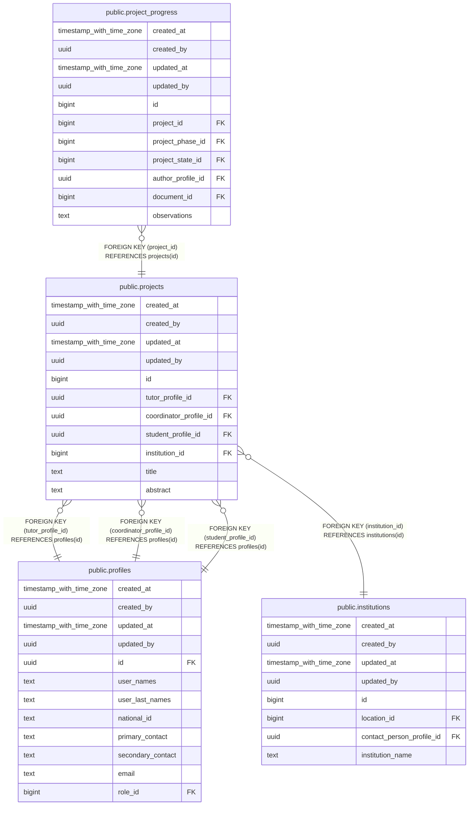

# public.projects

## Description

## Columns

| Name | Type | Default | Nullable | Children | Parents | Comment |
| ---- | ---- | ------- | -------- | -------- | ------- | ------- |
| created_at | timestamp with time zone | now() | false |  |  |  |
| created_by | uuid | auth.uid() | false |  |  |  |
| updated_at | timestamp with time zone | now() | false |  |  |  |
| updated_by | uuid | auth.uid() | true |  |  |  |
| id | bigint |  | false | [public.project_progress](public.project_progress.md) |  |  |
| tutor_profile_id | uuid |  | false |  | [public.profiles](public.profiles.md) |  |
| coordinator_profile_id | uuid |  | false |  | [public.profiles](public.profiles.md) |  |
| student_profile_id | uuid |  | false |  | [public.profiles](public.profiles.md) |  |
| institution_id | bigint |  | false |  | [public.institutions](public.institutions.md) |  |
| title | text |  | false |  |  |  |
| abstract | text |  | true |  |  |  |

## Constraints

| Name | Type | Definition |
| ---- | ---- | ---------- |
| projects_coordinator_profile_id_fkey | FOREIGN KEY | FOREIGN KEY (coordinator_profile_id) REFERENCES profiles(id) |
| projects_student_profile_id_fkey | FOREIGN KEY | FOREIGN KEY (student_profile_id) REFERENCES profiles(id) |
| projects_tutor_profile_id_fkey | FOREIGN KEY | FOREIGN KEY (tutor_profile_id) REFERENCES profiles(id) |
| projects_institution_id_fkey | FOREIGN KEY | FOREIGN KEY (institution_id) REFERENCES institutions(id) |
| projects_pkey | PRIMARY KEY | PRIMARY KEY (id) |

## Indexes

| Name | Definition |
| ---- | ---------- |
| projects_pkey | CREATE UNIQUE INDEX projects_pkey ON public.projects USING btree (id) |

## Triggers

| Name | Definition |
| ---- | ---------- |
| a_set_project_staff_on_insert | CREATE TRIGGER a_set_project_staff_on_insert BEFORE INSERT ON public.projects FOR EACH ROW EXECUTE FUNCTION set_project_staff_on_insert() |
| trg_audit_update_projects | CREATE TRIGGER trg_audit_update_projects BEFORE UPDATE ON public.projects FOR EACH ROW EXECUTE FUNCTION handle_audit_update() |
| audit_projects_changes | CREATE TRIGGER audit_projects_changes AFTER INSERT OR DELETE OR UPDATE ON public.projects FOR EACH ROW EXECUTE FUNCTION log_changes() |

## Relations

```mermaid
erDiagram

"public.project_progress" }o--|| "public.projects" : "FOREIGN KEY (project_id) REFERENCES projects(id)"
"public.projects" }o--|| "public.profiles" : "FOREIGN KEY (tutor_profile_id) REFERENCES profiles(id)"
"public.projects" }o--|| "public.profiles" : "FOREIGN KEY (coordinator_profile_id) REFERENCES profiles(id)"
"public.projects" }o--|| "public.profiles" : "FOREIGN KEY (student_profile_id) REFERENCES profiles(id)"
"public.projects" }o--|| "public.institutions" : "FOREIGN KEY (institution_id) REFERENCES institutions(id)"

"public.projects" {
  timestamp_with_time_zone created_at ""
  uuid created_by ""
  timestamp_with_time_zone updated_at ""
  uuid updated_by ""
  bigint id ""
  uuid tutor_profile_id FK ""
  uuid coordinator_profile_id FK ""
  uuid student_profile_id FK ""
  bigint institution_id FK ""
  text title ""
  text abstract ""
}
"public.project_progress" {
  timestamp_with_time_zone created_at ""
  uuid created_by ""
  timestamp_with_time_zone updated_at ""
  uuid updated_by ""
  bigint id ""
  bigint project_id FK ""
  bigint project_phase_id FK ""
  bigint project_state_id FK ""
  uuid author_profile_id FK ""
  bigint document_id FK ""
  text observations ""
}
"public.profiles" {
  timestamp_with_time_zone created_at ""
  uuid created_by ""
  timestamp_with_time_zone updated_at ""
  uuid updated_by ""
  uuid id FK ""
  text user_names ""
  text user_last_names ""
  text national_id ""
  text primary_contact ""
  text secondary_contact ""
  text email ""
  bigint role_id FK ""
}
"public.institutions" {
  timestamp_with_time_zone created_at ""
  uuid created_by ""
  timestamp_with_time_zone updated_at ""
  uuid updated_by ""
  bigint id ""
  bigint location_id FK ""
  uuid contact_person_profile_id FK ""
  text institution_name ""
}
```

---

> Generated by [tbls](https://github.com/k1LoW/tbls)
