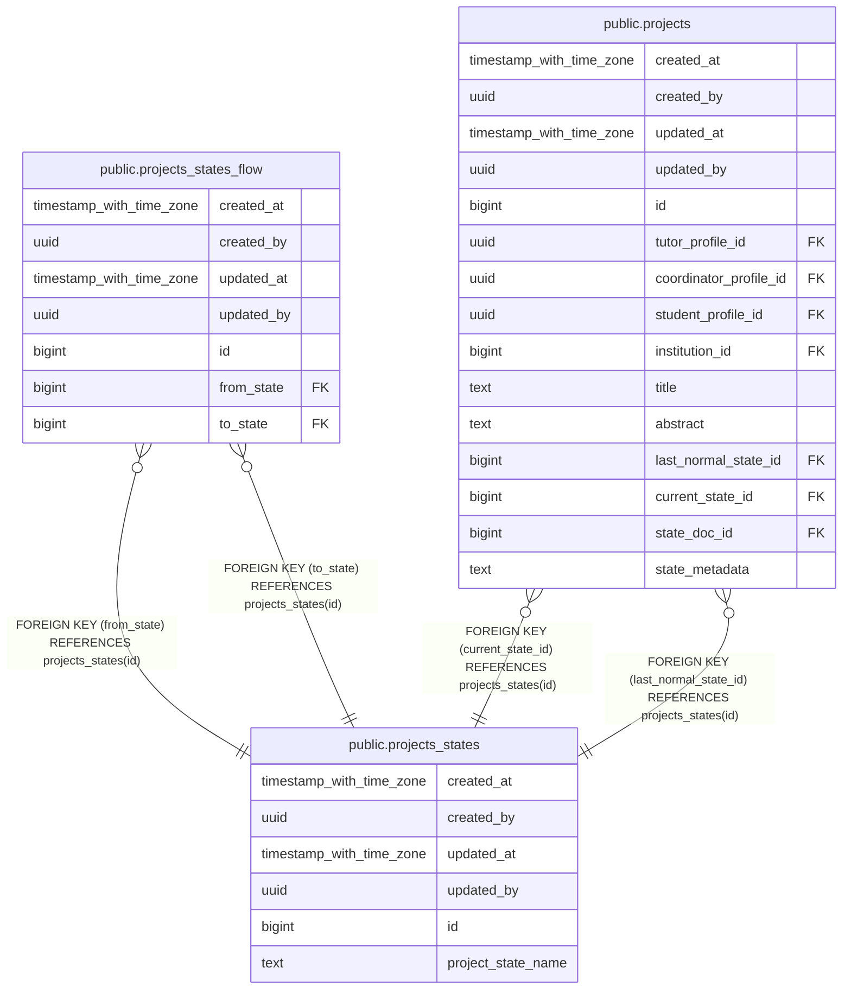

# public.projects_states

## Description

## Columns

| Name | Type | Default | Nullable | Children | Parents | Comment |
| ---- | ---- | ------- | -------- | -------- | ------- | ------- |
| created_at | timestamp with time zone | now() | false |  |  |  |
| created_by | uuid | auth.uid() | false |  |  |  |
| updated_at | timestamp with time zone | now() | false |  |  |  |
| updated_by | uuid | auth.uid() | true |  |  |  |
| id | bigint |  | false | [public.projects_states_flow](public.projects_states_flow.md) [public.projects](public.projects.md) |  |  |
| project_state_name | text |  | false |  |  |  |

## Constraints

| Name | Type | Definition |
| ---- | ---- | ---------- |
| projects_states_pkey | PRIMARY KEY | PRIMARY KEY (id) |

## Indexes

| Name | Definition |
| ---- | ---------- |
| projects_states_pkey | CREATE UNIQUE INDEX projects_states_pkey ON public.projects_states USING btree (id) |

## Relations

---

> Generated by [tbls](https://github.com/k1LoW/tbls)
