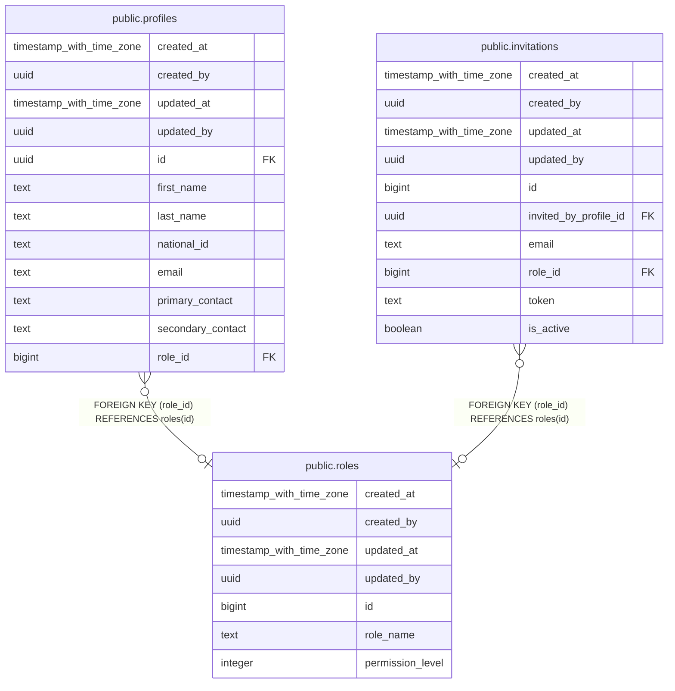

# public.roles

## Description

## Columns

| Name | Type | Default | Nullable | Children | Parents | Comment |
| ---- | ---- | ------- | -------- | -------- | ------- | ------- |
| created_at | timestamp with time zone | now() | false |  |  |  |
| created_by | uuid | auth.uid() | false |  |  |  |
| updated_at | timestamp with time zone | now() | false |  |  |  |
| updated_by | uuid | auth.uid() | true |  |  |  |
| id | bigint |  | false | [public.profiles](public.profiles.md) [public.invitations](public.invitations.md) |  |  |
| role_name | text |  | false |  |  |  |
| permission_level | integer |  | false |  |  |  |

## Constraints

| Name | Type | Definition |
| ---- | ---- | ---------- |
| roles_pkey | PRIMARY KEY | PRIMARY KEY (id) |
| roles_role_name_key | UNIQUE | UNIQUE (role_name) |

## Indexes

| Name | Definition |
| ---- | ---------- |
| roles_pkey | CREATE UNIQUE INDEX roles_pkey ON public.roles USING btree (id) |
| roles_role_name_key | CREATE UNIQUE INDEX roles_role_name_key ON public.roles USING btree (role_name) |

## Triggers

| Name | Definition |
| ---- | ---------- |
| trg_audit_update_roles | CREATE TRIGGER trg_audit_update_roles BEFORE UPDATE ON public.roles FOR EACH ROW EXECUTE FUNCTION handle_audit_update() |
| audit_roles_changes | CREATE TRIGGER audit_roles_changes AFTER INSERT OR DELETE OR UPDATE ON public.roles FOR EACH ROW EXECUTE FUNCTION log_changes() |

## Relations

---

> Generated by [tbls](https://github.com/k1LoW/tbls)
