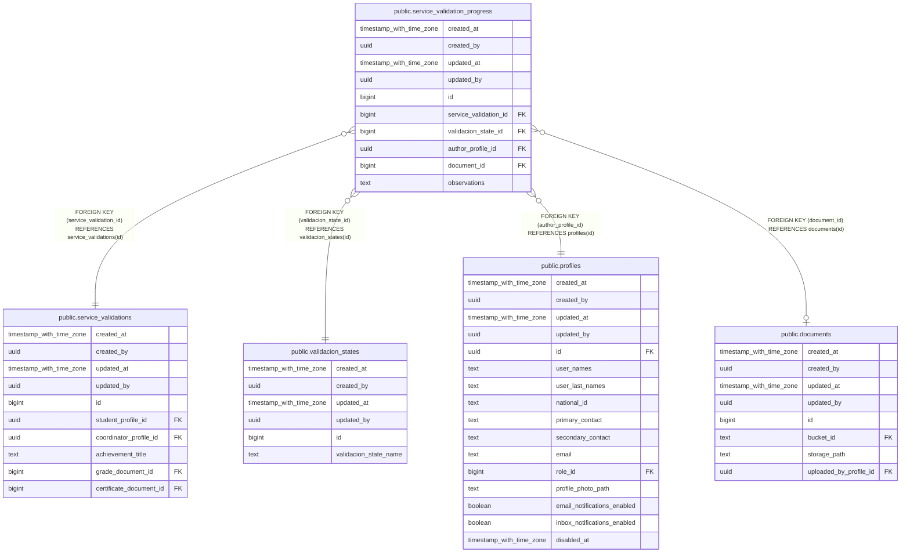

# public.service_validation_progress

## Description

## Columns

| Name | Type | Default | Nullable | Children | Parents | Comment |
| ---- | ---- | ------- | -------- | -------- | ------- | ------- |
| created_at | timestamp with time zone | now() | false |  |  |  |
| created_by | uuid | auth.uid() | false |  |  |  |
| updated_at | timestamp with time zone | now() | false |  |  |  |
| updated_by | uuid | auth.uid() | true |  |  |  |
| id | bigint |  | false |  |  |  |
| service_validation_id | bigint |  | false |  | [public.service_validations](public.service_validations.md) |  |
| validacion_state_id | bigint |  | false |  | [public.validacion_states](public.validacion_states.md) |  |
| author_profile_id | uuid |  | false |  | [public.profiles](public.profiles.md) |  |
| document_id | bigint |  | true |  | [public.documents](public.documents.md) |  |
| observations | text |  | true |  |  |  |

## Constraints

| Name | Type | Definition |
| ---- | ---- | ---------- |
| service_validation_progress_author_profile_id_fkey | FOREIGN KEY | FOREIGN KEY (author_profile_id) REFERENCES profiles(id) |
| service_validation_progress_document_id_fkey | FOREIGN KEY | FOREIGN KEY (document_id) REFERENCES documents(id) |
| service_validation_progress_validacion_state_id_fkey | FOREIGN KEY | FOREIGN KEY (validacion_state_id) REFERENCES validacion_states(id) |
| service_validation_progress_service_validation_id_fkey | FOREIGN KEY | FOREIGN KEY (service_validation_id) REFERENCES service_validations(id) |
| service_validation_progress_pkey | PRIMARY KEY | PRIMARY KEY (id) |

## Indexes

| Name | Definition |
| ---- | ---------- |
| service_validation_progress_pkey | CREATE UNIQUE INDEX service_validation_progress_pkey ON public.service_validation_progress USING btree (id) |
| idx_service_validation_progress_lookup | CREATE INDEX idx_service_validation_progress_lookup ON public.service_validation_progress USING btree (service_validation_id, created_at DESC, id DESC) |

## Triggers

| Name | Definition |
| ---- | ---------- |
| a_validate_service_validation_progress_transition | CREATE TRIGGER a_validate_service_validation_progress_transition BEFORE INSERT ON public.service_validation_progress FOR EACH ROW EXECUTE FUNCTION validate_service_validation_progress_transition() |
| audit_service_validation_progress_changes | CREATE TRIGGER audit_service_validation_progress_changes AFTER INSERT OR DELETE OR UPDATE ON public.service_validation_progress FOR EACH ROW EXECUTE FUNCTION log_changes() |
| b_enqueue_validation_progress_notification_event | CREATE TRIGGER b_enqueue_validation_progress_notification_event AFTER INSERT OR UPDATE ON public.service_validation_progress FOR EACH ROW EXECUTE FUNCTION enqueue_validation_progress_notification_event() |
| trg_audit_update_service_validation_progress | CREATE TRIGGER trg_audit_update_service_validation_progress BEFORE UPDATE ON public.service_validation_progress FOR EACH ROW EXECUTE FUNCTION handle_audit_update() |

## Relations

---

> Generated by [tbls](https://github.com/k1LoW/tbls)
