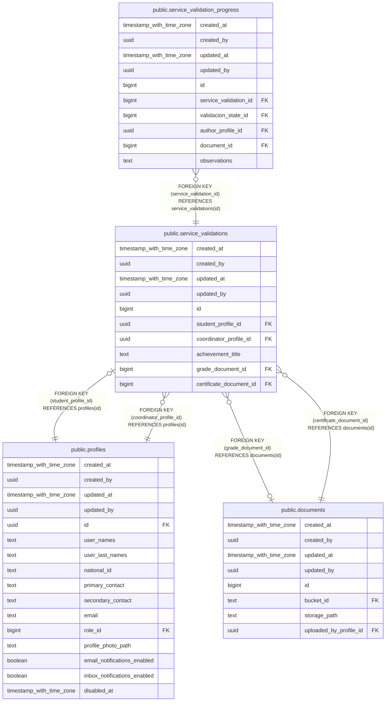

# public.service_validations

## Description

## Columns

| Name | Type | Default | Nullable | Children | Parents | Comment |
| ---- | ---- | ------- | -------- | -------- | ------- | ------- |
| created_at | timestamp with time zone | now() | false |  |  |  |
| created_by | uuid | auth.uid() | false |  |  |  |
| updated_at | timestamp with time zone | now() | false |  |  |  |
| updated_by | uuid | auth.uid() | true |  |  |  |
| id | bigint |  | false | [public.service_validation_progress](public.service_validation_progress.md) |  |  |
| student_profile_id | uuid |  | false |  | [public.profiles](public.profiles.md) |  |
| coordinator_profile_id | uuid |  | false |  | [public.profiles](public.profiles.md) |  |
| achievement_title | text |  | true |  |  |  |
| grade_document_id | bigint |  | true |  | [public.documents](public.documents.md) |  |
| certificate_document_id | bigint |  | false |  | [public.documents](public.documents.md) |  |

## Constraints

| Name | Type | Definition |
| ---- | ---- | ---------- |
| service_validations_coordinator_profile_id_fkey | FOREIGN KEY | FOREIGN KEY (coordinator_profile_id) REFERENCES profiles(id) |
| service_validations_student_profile_id_fkey | FOREIGN KEY | FOREIGN KEY (student_profile_id) REFERENCES profiles(id) |
| service_validations_certificate_document_id_fkey | FOREIGN KEY | FOREIGN KEY (certificate_document_id) REFERENCES documents(id) |
| service_validations_grade_document_id_fkey | FOREIGN KEY | FOREIGN KEY (grade_document_id) REFERENCES documents(id) |
| service_validations_pkey | PRIMARY KEY | PRIMARY KEY (id) |
| service_validations_student_profile_id_unique | UNIQUE | UNIQUE (student_profile_id) |

## Indexes

| Name | Definition |
| ---- | ---------- |
| service_validations_pkey | CREATE UNIQUE INDEX service_validations_pkey ON public.service_validations USING btree (id) |
| service_validations_student_profile_id_unique | CREATE UNIQUE INDEX service_validations_student_profile_id_unique ON public.service_validations USING btree (student_profile_id) |

## Triggers

| Name | Definition |
| ---- | ---------- |
| a_set_service_validation_staff_on_insert | CREATE TRIGGER a_set_service_validation_staff_on_insert BEFORE INSERT ON public.service_validations FOR EACH ROW EXECUTE FUNCTION set_service_validation_staff_on_insert() |
| a_validate_service_validation_no_project | CREATE TRIGGER a_validate_service_validation_no_project BEFORE INSERT OR UPDATE ON public.service_validations FOR EACH ROW EXECUTE FUNCTION validate_service_validation_no_project() |
| audit_service_validations_changes | CREATE TRIGGER audit_service_validations_changes AFTER INSERT OR DELETE OR UPDATE ON public.service_validations FOR EACH ROW EXECUTE FUNCTION log_changes() |
| trg_audit_update_service_validations | CREATE TRIGGER trg_audit_update_service_validations BEFORE UPDATE ON public.service_validations FOR EACH ROW EXECUTE FUNCTION handle_audit_update() |

## Relations

---

> Generated by [tbls](https://github.com/k1LoW/tbls)
