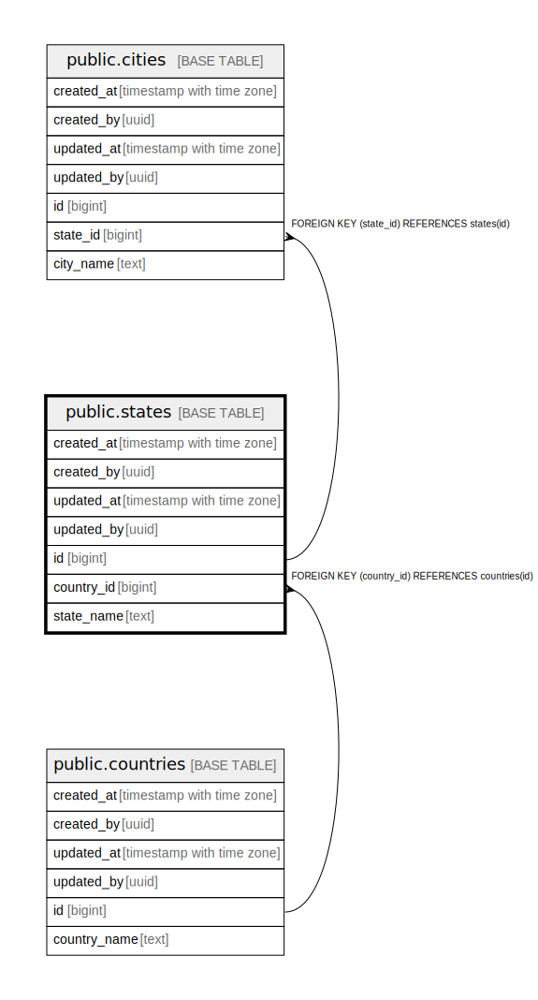

# public.states

## Description

## Columns

| Name | Type | Default | Nullable | Children | Parents | Comment |
| ---- | ---- | ------- | -------- | -------- | ------- | ------- |
| created_at | timestamp with time zone | now() | false |  |  |  |
| created_by | uuid | auth.uid() | false |  |  |  |
| updated_at | timestamp with time zone | now() | false |  |  |  |
| updated_by | uuid | auth.uid() | true |  |  |  |
| id | bigint |  | false | [public.cities](public.cities.md) |  |  |
| country_id | bigint |  | false |  | [public.countries](public.countries.md) |  |
| state_name | text |  | false |  |  |  |

## Constraints

| Name | Type | Definition |
| ---- | ---- | ---------- |
| states_country_id_fkey | FOREIGN KEY | FOREIGN KEY (country_id) REFERENCES countries(id) |
| states_pkey | PRIMARY KEY | PRIMARY KEY (id) |
| states_state_name_key | UNIQUE | UNIQUE (state_name) |

## Indexes

| Name | Definition |
| ---- | ---------- |
| states_pkey | CREATE UNIQUE INDEX states_pkey ON public.states USING btree (id) |
| states_state_name_key | CREATE UNIQUE INDEX states_state_name_key ON public.states USING btree (state_name) |

## Triggers

| Name | Definition |
| ---- | ---------- |
| trg_audit_update_states | CREATE TRIGGER trg_audit_update_states BEFORE UPDATE ON public.states FOR EACH ROW EXECUTE FUNCTION handle_audit_update() |
| audit_states_changes | CREATE TRIGGER audit_states_changes AFTER INSERT OR DELETE OR UPDATE ON public.states FOR EACH ROW EXECUTE FUNCTION log_changes() |

## Relations

---

> Generated by [tbls](https://github.com/k1LoW/tbls)
