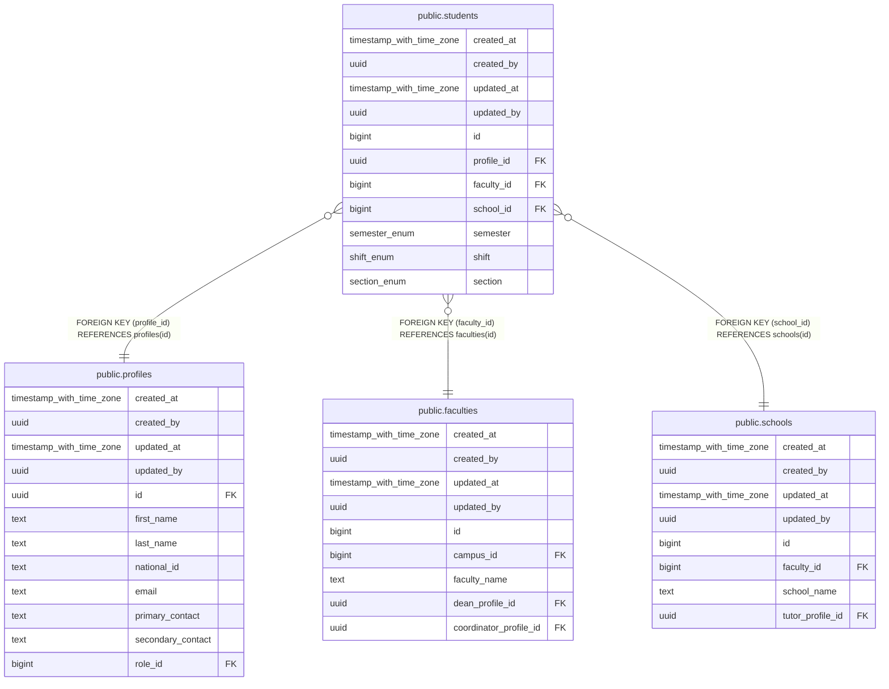

# public.students

## Description

## Columns

| Name | Type | Default | Nullable | Children | Parents | Comment |
| ---- | ---- | ------- | -------- | -------- | ------- | ------- |
| created_at | timestamp with time zone | now() | false |  |  |  |
| created_by | uuid | auth.uid() | false |  |  |  |
| updated_at | timestamp with time zone | now() | false |  |  |  |
| updated_by | uuid | auth.uid() | true |  |  |  |
| id | bigint |  | false |  |  |  |
| profile_id | uuid |  | false |  | [public.profiles](public.profiles.md) |  |
| faculty_id | bigint |  | false |  | [public.faculties](public.faculties.md) |  |
| school_id | bigint |  | false |  | [public.schools](public.schools.md) |  |
| semester | semester_enum |  | true |  |  |  |
| shift | shift_enum |  | true |  |  |  |
| section | section_enum |  | true |  |  |  |

## Constraints

| Name | Type | Definition |
| ---- | ---- | ---------- |
| students_profile_id_fkey | FOREIGN KEY | FOREIGN KEY (profile_id) REFERENCES profiles(id) |
| students_faculty_id_fkey | FOREIGN KEY | FOREIGN KEY (faculty_id) REFERENCES faculties(id) |
| students_school_id_fkey | FOREIGN KEY | FOREIGN KEY (school_id) REFERENCES schools(id) |
| students_pkey | PRIMARY KEY | PRIMARY KEY (id) |

## Indexes

| Name | Definition |
| ---- | ---------- |
| students_pkey | CREATE UNIQUE INDEX students_pkey ON public.students USING btree (id) |

## Triggers

| Name | Definition |
| ---- | ---------- |
| trg_audit_update_students | CREATE TRIGGER trg_audit_update_students BEFORE UPDATE ON public.students FOR EACH ROW EXECUTE FUNCTION handle_audit_update() |
| audit_students_changes | CREATE TRIGGER audit_students_changes AFTER INSERT OR DELETE OR UPDATE ON public.students FOR EACH ROW EXECUTE FUNCTION log_changes() |

## Relations

---

> Generated by [tbls](https://github.com/k1LoW/tbls)
