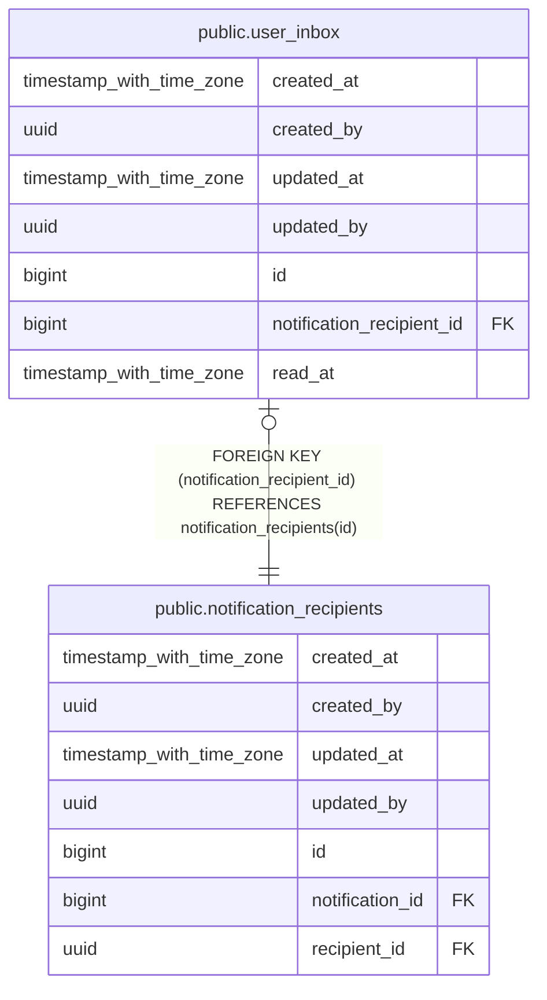

# public.user_inbox

## Description

## Columns

| Name | Type | Default | Nullable | Children | Parents | Comment |
| ---- | ---- | ------- | -------- | -------- | ------- | ------- |
| created_at | timestamp with time zone | now() | false |  |  |  |
| created_by | uuid | auth.uid() | false |  |  |  |
| updated_at | timestamp with time zone | now() | false |  |  |  |
| updated_by | uuid | auth.uid() | true |  |  |  |
| id | bigint |  | false |  |  |  |
| notification_recipient_id | bigint |  | false |  | [public.notification_recipients](public.notification_recipients.md) |  |
| read_at | timestamp with time zone |  | true |  |  |  |

## Constraints

| Name | Type | Definition |
| ---- | ---- | ---------- |
| user_inbox_notification_recipient_id_fkey | FOREIGN KEY | FOREIGN KEY (notification_recipient_id) REFERENCES notification_recipients(id) |
| user_inbox_pkey | PRIMARY KEY | PRIMARY KEY (id) |
| user_inbox_notification_recipient_id_key | UNIQUE | UNIQUE (notification_recipient_id) |

## Indexes

| Name | Definition |
| ---- | ---------- |
| user_inbox_pkey | CREATE UNIQUE INDEX user_inbox_pkey ON public.user_inbox USING btree (id) |
| user_inbox_notification_recipient_id_key | CREATE UNIQUE INDEX user_inbox_notification_recipient_id_key ON public.user_inbox USING btree (notification_recipient_id) |
| idx_user_inbox_unread | CREATE INDEX idx_user_inbox_unread ON public.user_inbox USING btree (read_at) WHERE (read_at IS NULL) |

## Triggers

| Name | Definition |
| ---- | ---------- |
| audit_user_inbox_changes | CREATE TRIGGER audit_user_inbox_changes AFTER INSERT OR DELETE OR UPDATE ON public.user_inbox FOR EACH ROW EXECUTE FUNCTION log_changes() |
| trg_audit_update_user_inbox | CREATE TRIGGER trg_audit_update_user_inbox BEFORE UPDATE ON public.user_inbox FOR EACH ROW EXECUTE FUNCTION handle_audit_update() |

## Relations

---

> Generated by [tbls](https://github.com/k1LoW/tbls)
