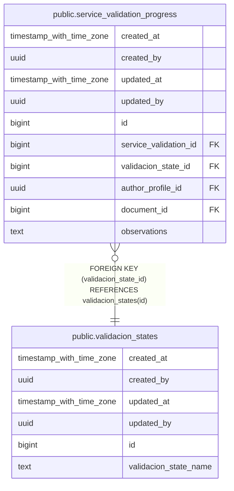

# public.validacion_states

## Description

## Columns

| Name | Type | Default | Nullable | Children | Parents | Comment |
| ---- | ---- | ------- | -------- | -------- | ------- | ------- |
| created_at | timestamp with time zone | now() | false |  |  |  |
| created_by | uuid | auth.uid() | false |  |  |  |
| updated_at | timestamp with time zone | now() | false |  |  |  |
| updated_by | uuid | auth.uid() | true |  |  |  |
| id | bigint |  | false | [public.service_validation_progress](public.service_validation_progress.md) |  |  |
| validacion_state_name | text |  | false |  |  |  |

## Constraints

| Name | Type | Definition |
| ---- | ---- | ---------- |
| validacion_states_pkey | PRIMARY KEY | PRIMARY KEY (id) |
| validacion_states_validacion_state_name_key | UNIQUE | UNIQUE (validacion_state_name) |

## Indexes

| Name | Definition |
| ---- | ---------- |
| validacion_states_pkey | CREATE UNIQUE INDEX validacion_states_pkey ON public.validacion_states USING btree (id) |
| validacion_states_validacion_state_name_key | CREATE UNIQUE INDEX validacion_states_validacion_state_name_key ON public.validacion_states USING btree (validacion_state_name) |

## Triggers

| Name | Definition |
| ---- | ---------- |
| audit_validacion_states_changes | CREATE TRIGGER audit_validacion_states_changes AFTER INSERT OR DELETE OR UPDATE ON public.validacion_states FOR EACH ROW EXECUTE FUNCTION log_changes() |
| trg_audit_update_validacion_states | CREATE TRIGGER trg_audit_update_validacion_states BEFORE UPDATE ON public.validacion_states FOR EACH ROW EXECUTE FUNCTION handle_audit_update() |

## Relations

---

> Generated by [tbls](https://github.com/k1LoW/tbls)
